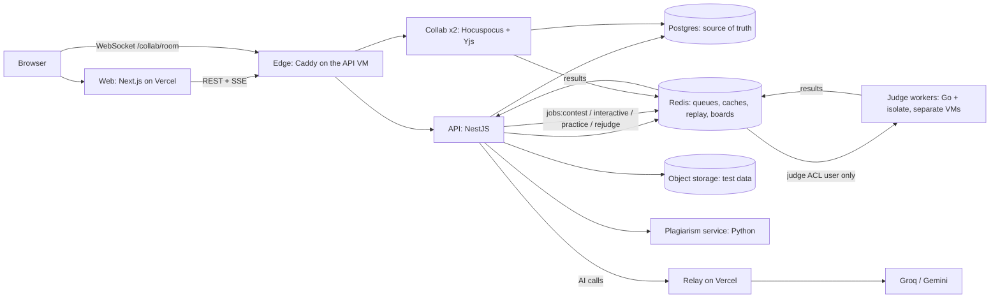

# CodeArena

An online judge and contest platform that runs untrusted code safely, scores contests live, coaches students with AI that does not hand out solutions, flags suspicious similarity for a human to review, and has a collaborative interview pad with replay.

Built as one monorepo by one person with an AI pair programmer, and measured: every number below comes from a script in this repository and is written to [`docs/METRICS.md`](docs/METRICS.md) with its caveats.

**Live:** web <https://code-arena-eta-mauve.vercel.app> · the public "Under the hood" status page is at `/status`.

## What it does

| Area              | What you get                                                                                                                                                                                                                                                                                                        |
| ----------------- | ------------------------------------------------------------------------------------------------------------------------------------------------------------------------------------------------------------------------------------------------------------------------------------------------------------------- |
| **Judge**         | C, C++17/20, Java 21, Python 3 and Node.js in an [isolate](https://github.com/ioi/isolate) sandbox (cgroup v2): time, memory, process and output limits, no network, empty environment, compile step sandboxed too. Verdicts AC / WA / TLE / MLE / RE / CE / OLE / SE, custom checkers (testlib), per-test results. |
| **Contests**      | ICPC scoring and freeze, live board over Server-Sent Events, clarifications and announcements, an ICPC-style **resolver** ceremony for unfreezing, Codeforces-style ratings, optional exam mode, rejudge tools.                                                                                                     |
| **Practice**      | 20 problems with statements (maths rendered), samples you can run, a submission page with the journey of each submission (queued → judging → verdict).                                                                                                                                                              |
| **AI Coach**      | A three-level hint ladder (concept, approach, next step) behind a guardrail pipeline (sufficiency check, code-removal pass, deterministic filter), disabled in contests; post-contest reviews of your final submission.                                                                                             |
| **Fair play**     | Plagiarism pipeline (token fingerprints plus code embeddings) that only ever produces clusters for an administrator to review, advisory behavioural signals, an optional canary sentence. Nothing is automatic.                                                                                                     |
| **Interview pad** | Real-time shared code editor (Yjs, Hocuspocus), roles (interviewer, candidate, observer), Run and Submit from the pad, private interviewer notes, a whiteboard, version restore, offline editing, a replay of the whole session, and an AI summary only the interviewer can read.                                   |
| **Operations**    | Terraform-managed Azure VMs, a deploy pipeline with automatic rollback, backups with a restore test, failure drills, OpenTelemetry traces (one submission is one trace, from the HTTP request to the verdict), runbooks for contest day.                                                                            |

## Screenshots and recordings

Not recorded yet. They are produced from the demo script (plan card W-02) and will live in `docs/media/`:

1. A submission going queued → judging → AC, with its grid of tests filling in.
2. The live board during a contest and the resolver unfreezing it.
3. The hint ladder, and a hint refusing to show code.
4. A plagiarism cluster in the review UI.
5. Two browsers in an interview room: cursors, Run, notes, whiteboard, restore.
6. The session replay with the scrubber.

## Architecture



How a submission travels: the API stores it in Postgres, appends a job to the Redis stream of its **lane** (contest, interactive, practice, rejudge: strict priority, with every 8th claim taken from the lowest non-empty lane so nothing starves). A worker claims it with a lease it refreshes every 2 s; a reaper takes the job over with `XAUTOCLAIM` if the worker dies, and after 3 failed deliveries it goes to a dead-letter queue. The worker judges in isolate and publishes the verdict on the `results` stream; the API applies it idempotently, recomputes the leaderboard cell from Postgres, and pushes the change to every browser over SSE.

Key decisions, each with its alternatives and costs, are in [`docs/adr/`](docs/adr/README.md): a Go worker driving isolate, Redis Streams with leases, SSE for one-way data and WebSocket for the pad only, OAuth-only auth with single-use realtime tickets, Zod contracts that generate the Go types, **judge hosts treated as untrusted**, Postgres as the source of truth.

## Measured

All of this was measured on this project's own infrastructure (Azure B-series VMs, one laptop for the local runs). The caveats are in `docs/METRICS.md`; read them before quoting a number.

| What                                                                                                                            | Result                                                                                                                                                                                                         |
| ------------------------------------------------------------------------------------------------------------------------------- | -------------------------------------------------------------------------------------------------------------------------------------------------------------------------------------------------------------- |
| **Contest burst**: 500 submissions in 2 minutes, 200 browsers watching the board                                                | 1 judge VM: drained 58 s after the last submit (queue wait p95 48.6 s). 2 judge VMs: p95 time to verdict **2.1 s**, drained in 2 s. The design estimate had assumed 15 minutes for one judge.                  |
| **Failure drills**: kill a worker, kill the API, restart Redis (clean and hard), stop a judge VM, poison a job                  | **6 of 6 pass on production and locally**: every accepted submission got exactly one verdict, nothing stuck, the board equalled the rebuild from Postgres. The poison drill found and fixed a real bug.        |
| **Sandbox**: 28 attack programs (fork bomb, memory bomb, symlink and `/proc` reads, network, ptrace, mount, chroot escape, ...) | All contained, run in CI and nightly. The first run found that boxes could see the host's whole `/dev`; fixed.                                                                                                 |
| **Interview pad**: simulated typists against real collab servers                                                                | p95 edit propagation **2.1 ms** at 10 rooms × 3 people (target 200 ms), 5.8 ms at 100 rooms (292 clients); nothing lost, every room ended with identical text.                                                 |
| **Hint safety**: 66-item eval including prompt injection in the code                                                            | `hint-main@2`: **0 leaks in 54 hints** (the first prompt version leaked 3.7 % and failed; the eval found why). The model judge flags 24.5 % of hints as saying more than their level allows: the open problem. |
| **Plagiarism**: 3,476 labelled pairs over 20 problems                                                                           | Held-out **92.1 % recall at 88.7 % precision**. Independent solutions are AI-written, not students', so the real test is a real contest.                                                                       |
| **Tests** (2026-10-09)                                                                                                          | API 506, web 161, collab 85, contracts 12 unit and integration tests; 321 browser tests with real Monaco and real collab servers; Go and Python suites; contract freshness check.                              |

## Security

- **The judge runs hostile code, so its host is assumed hostile.** Workers sit on separate VMs, hold no database credentials, and reach Redis as an ACL user that can only touch job streams. A compromised judge can at worst forge results for jobs it was given, which schema and run-version checks limit.
- **Sandbox rules**: no network, an empty environment except `PATH`, the compile step sandboxed with the same limits, outputs read with `O_NOFOLLOW` + `fstat` + a size cap (never by following paths inside a box), a non-root worker.
- **Auth**: Google and GitHub OAuth only (PKCE, state); a 15-minute ES256 access token; a rotating, hashed, httpOnly refresh cookie whose reuse revokes the whole family; double-submit CSRF token on mutations; single-use 60-second tickets for SSE and WebSocket.
- **Everywhere**: Zod validation at every boundary, RFC 7807 errors, per-user rate limits in Redis, CSP and security headers, an audit log for admin actions, CodeQL and Dependabot.
- **Interview pad**: identities come from the verified ticket, never from what a client claims; observers are read-only on the server; the interviewer's notes and the AI summary are outside the shared document and readable by that interviewer only (a test sweeps every registered route to prove it); documents are capped at 2 MB and sessions at 90 minutes.
- **AI**: everything from users (code, notes, comments) goes to a model inside delimited blocks the prompt calls data, not instructions; hints pass a removal pass and a deterministic filter; no e-mail or id is sent; the privacy page says what is sent where.
- **Hidden tests never enter the public repository** (`problems-private/` is gitignored).
- **Honest limits**: exam mode is a deterrent with an audit trail, not proctoring; the plagiarism pipeline and the canary sentence are signals for a person, not verdicts; the AI hints can still over-reveal (see above).

## Run it locally

You need Linux or WSL2 (Ubuntu 24.04, with `systemd=true` for isolate), Docker, Node.js 22 or newer, pnpm 12, Go 1.26 and, for the plagiarism service, [uv](https://docs.astral.sh/uv/).

```bash
pnpm install

# the dev stack: Postgres, Redis (three ACL users), object storage, OpenTelemetry collector
scripts/dev-up.sh

# configuration: copy each app's .env.example to .env and fill the values in
# (apps/api, apps/worker, ...). scripts/gen-keys.sh prints the access-token key pair to paste into apps/api/.env.
scripts/gen-keys.sh

# the judge sandbox (once; needs sudo): installs isolate and the language runtimes
sudo scripts/setup-isolate-wsl.sh && sudo scripts/setup-judge-runtimes.sh

pnpm db:reset                                  # create the schema
pnpm problem:import --publish problems         # the 20 public problems
pnpm dev                                       # web, API, worker, collab, (plag)
```

Web is on <http://localhost:3000>, the API on <http://localhost:4000>. Secrets are never committed: only the `.env.example` files are.

| Command                                                          | What it does                                                                 |
| ---------------------------------------------------------------- | ---------------------------------------------------------------------------- |
| `pnpm check`                                                     | lint, typecheck, unit and integration tests, contract freshness              |
| `pnpm test` / `pnpm e2e`                                         | all unit and integration tests / the browser tests                           |
| `pnpm attack`                                                    | the 28 sandbox attack programs (needs isolate)                               |
| `pnpm contracts:gen`                                             | regenerate JSON Schema and Go types from the Zod contracts                   |
| `pnpm load:local`                                                | a small load rehearsal of the judge pipeline                                 |
| `pnpm --filter @codearena/collab pad-load`                       | the interview pad load test                                                  |
| `pnpm eval:hints`                                                | the hint leak eval (needs AI provider keys, so it runs on the production VM) |
| `go test ./...` in `apps/worker`, `uv run pytest` in `apps/plag` | the Go and Python suites                                                     |

## Repository map

| Path                 | What                                                                             |
| -------------------- | -------------------------------------------------------------------------------- |
| `apps/web`           | Next.js App Router, Tailwind v4, shadcn/ui: the product                          |
| `apps/api`           | NestJS, Drizzle, Postgres, Redis: REST, SSE, queue, boards, AI, rooms            |
| `apps/worker`        | Go judge worker controlling isolate                                              |
| `apps/collab`        | Hocuspocus (Yjs) server for the interview pad                                    |
| `apps/plag`          | Python plagiarism batch service                                                  |
| `packages/contracts` | Zod schemas: the source of truth for the API, generated JSON Schema and Go types |
| `infra/`             | Docker Compose, Terraform for Azure, cloud-init, Caddy, Grafana                  |
| `tests/`             | attack suite, chaos drills, load tests                                           |
| `problems/`          | the public practice problems (statement, tests, reference and wrong solutions)   |

## Documentation

- Product and requirements: [PRD](docs/PRD.md) · [SRS](docs/SRS.md) · [UI/UX](docs/UI_UX.md)
- How it works, with an "As built" section per card: [System design](docs/SYSTEM_DESIGN.md)
- Decisions: [ADR index](docs/adr/README.md)
- The build plan and the log of what was done and why: [PLAN](docs/PLAN.md) · [PROGRESS](docs/PROGRESS.md)
- Numbers: [METRICS](docs/METRICS.md)
- Running it for real: [contest day](docs/runbooks/contest-day.md) · [deploy](docs/runbooks/deploy.md) · [collab](docs/runbooks/collab.md) · [plagiarism](docs/runbooks/plagiarism.md) · [backup and restore](docs/runbooks/backup-restore.md) · [failure drills](docs/runbooks/failure-drills.md)
- Interview preparation notes: [docs/interview](docs/interview/answers.md)

## Status

Everything on the plan's critical path is built and deployed. The upgrade paths the design deliberately left out (KEDA autoscaling, gVisor or Firecracker per job, a vector store, an external identity provider) are written up in [ADR-014](docs/adr/014-upgrade-paths.md) rather than built.
