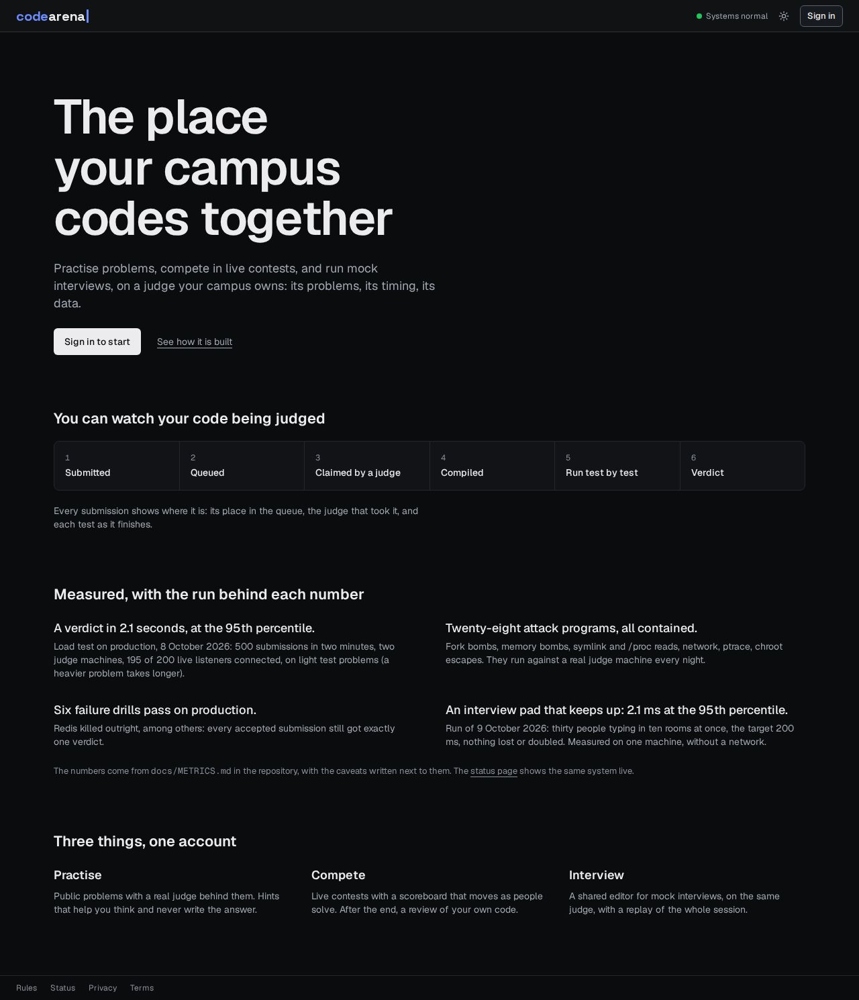
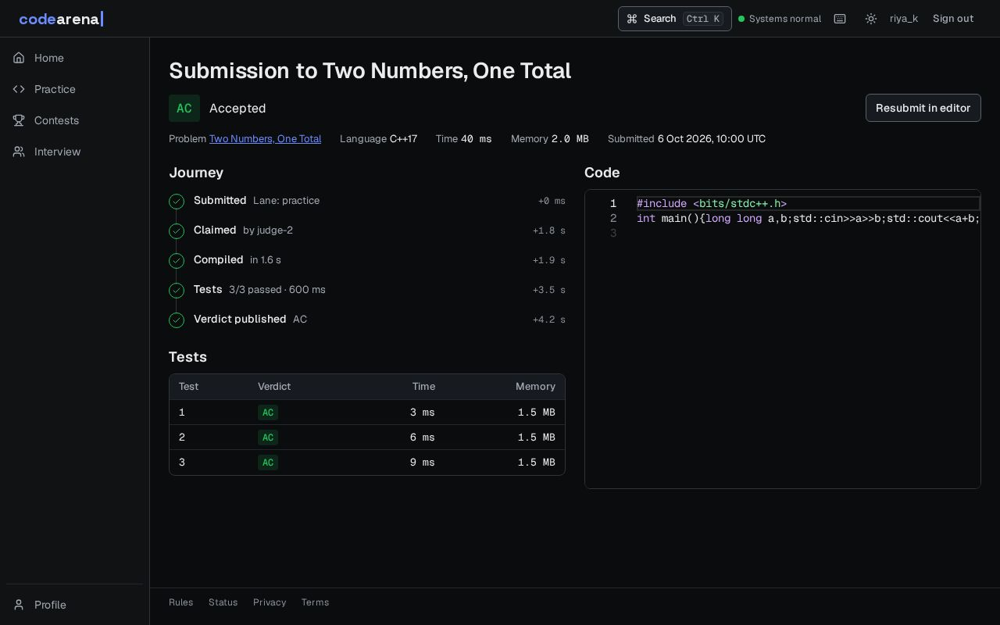
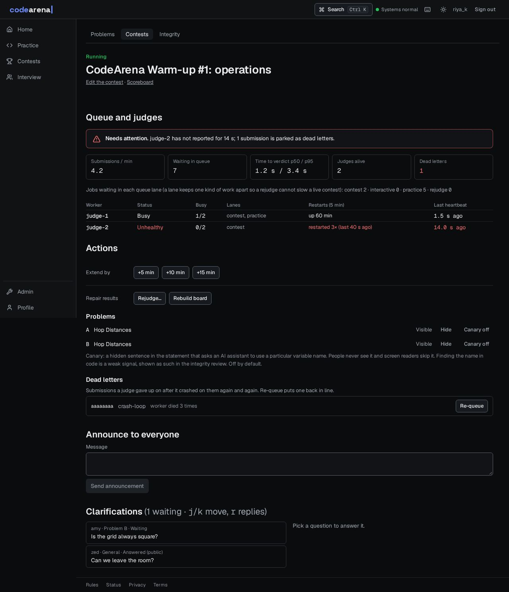
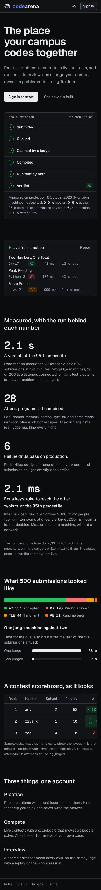
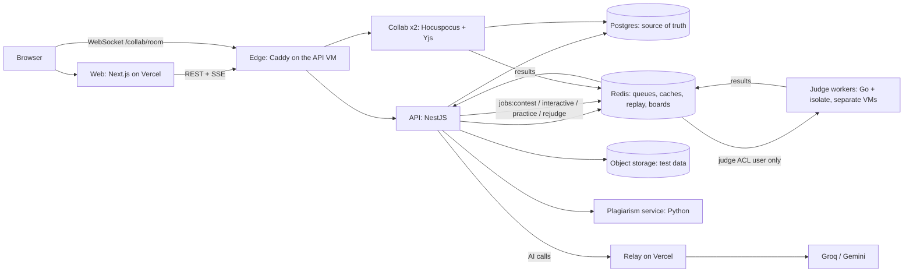

<div align="center">

# CodeArena

**An online judge and contest platform for campuses: untrusted code runs in a sandbox, contests are scored live, an AI coach gives hints without giving away solutions, and a collaborative pad runs mock interviews.**

[](https://github.com/SoumiryaSarangi/CodeArena/actions/workflows/ci.yml)
[](https://github.com/SoumiryaSarangi/CodeArena/actions/workflows/codeql.yml)
[](https://github.com/SoumiryaSarangi/CodeArena/actions/workflows/nightly-attack.yml)

[Live site](https://code-arena-eta-mauve.vercel.app) · [System status](https://code-arena-eta-mauve.vercel.app/status) · [Architecture](#architecture) · [Measured results](#measured-results) · [Documentation](#documentation)



</div>

---

## Contents

- [Overview](#overview)
- [Features](#features)
- [Screenshots](#screenshots)
- [Architecture](#architecture)
- [Tech stack](#tech-stack)
- [Measured results](#measured-results)
- [Security](#security)
- [Getting started](#getting-started)
- [Development](#development)
- [Repository layout](#repository-layout)
- [Deployment and operations](#deployment-and-operations)
- [Documentation](#documentation)
- [Project status](#project-status)
- [Contributing](#contributing)
- [License](#license)

## Overview

CodeArena lets a campus run its own practice problems, ICPC-style contests and mock interviews on infrastructure it controls. Students submit code in C, C++, Java, Python or Node.js; it runs in an [isolate](https://github.com/ioi/isolate) sandbox on separate judge machines, and the verdict reaches the browser within seconds.

It is one monorepo, built by one person with an AI pair programmer, and it is **measured**: every performance, reliability and safety number in this README comes from a script in this repository and is recorded with its caveats in [`docs/METRICS.md`](docs/METRICS.md).

## Features

| Area              | What you get                                                                                                                                                                                                                                                               |
| ----------------- | -------------------------------------------------------------------------------------------------------------------------------------------------------------------------------------------------------------------------------------------------------------------------- |
| **Judge**         | C, C++17/20, Java 21, Python 3 and Node.js. Time, memory, process and output limits, no network, an empty environment, a sandboxed compile step. Verdicts AC / WA / TLE / MLE / RE / CE / OLE / SE, custom checkers (testlib) and per-test results.                        |
| **Contests**      | ICPC scoring and freeze, a live board over Server-Sent Events, clarifications and announcements, an ICPC-style **resolver** ceremony to unfreeze the board, Codeforces-style ratings, optional exam mode, rejudge tools.                                                   |
| **Practice**      | 20 problems with rendered maths, runnable samples, and a submission page that shows the journey of each submission (queued, claimed, compiling, running, verdict).                                                                                                         |
| **AI Coach**      | A three-level hint ladder (concept, approach, next step) behind a guardrail pipeline: a sufficiency check, a code-removal pass and a deterministic filter. Off during contests. Post-contest reviews of your final submission.                                             |
| **Fair play**     | Plagiarism detection (token fingerprints plus code embeddings) that only produces clusters for an administrator to review, advisory behavioural signals and an optional canary sentence. Nothing is decided automatically.                                                 |
| **Interview pad** | A real-time shared editor (Yjs, Hocuspocus) with interviewer, candidate and observer roles, Run and Submit from the pad, private interviewer notes, a whiteboard, version restore, offline editing, a full session replay and an AI summary only the interviewer can read. |
| **Operations**    | Terraform-managed Azure VMs, a deploy pipeline with automatic rollback, backups with a restore test, failure drills, OpenTelemetry traces (one submission is one trace, from the HTTP request to the verdict), a public status page and a contest-day runbook.             |

## Screenshots

Captured by the repository's own harness against stubbed API data, so they show the design rather than a live contest. The full set (both themes, 1280 and 390 px) is in [`docs/design/round2/after/`](docs/design/round2/after/).

|                                                                                             |                                                                                        |
| ------------------------------------------------------------------------------------------- | -------------------------------------------------------------------------------------- |
|  |  |
| The live scoreboard, with your standing                                                     | A submission and the journey it took                                                   |
|                        |       |
| Contest operations: health first                                                            | The same product on a phone                                                            |

## Architecture



**How a submission travels.** The API stores it in Postgres and appends a job to the Redis stream of its _lane_ (contest, interactive, practice, rejudge: strict priority, with every 8th claim taken from the lowest non-empty lane so nothing starves). A worker claims it with a lease it refreshes every 2 s; a reaper takes the job over with `XAUTOCLAIM` if the worker dies, and after 3 failed deliveries it goes to a dead-letter queue. The worker judges in isolate and publishes the verdict on the `results` stream; the API applies it idempotently, recomputes the leaderboard cell from Postgres and pushes the change to every browser over SSE.

Each key decision, with its alternatives and costs, is an ADR in [`docs/adr/`](docs/adr/README.md): a Go worker driving isolate, Redis Streams with leases, SSE for one-way data and WebSocket for the pad only, OAuth-only auth with single-use realtime tickets, Zod contracts that generate the Go types, **judge hosts treated as untrusted**, and Postgres as the source of truth.

## Tech stack

| Layer      | Choices                                                                                                      |
| ---------- | ------------------------------------------------------------------------------------------------------------ |
| Web        | Next.js (App Router), React, Tailwind CSS v4, shadcn/ui, Monaco editor, Geist                                |
| API        | NestJS (Express), Drizzle ORM, Postgres, Redis, Zod validation, RFC 7807 errors                              |
| Judge      | Go worker controlling isolate 2.x on cgroup v2, Redis Streams with lease and reaper                          |
| Real time  | Server-Sent Events for verdicts and boards; Hocuspocus (Yjs) over WebSocket for the interview pad            |
| Plagiarism | Python (uv), tree-sitter, winnowing fingerprints, UniXcoder embeddings                                       |
| Contracts  | Zod schemas as the source of truth, generated JSON Schema and Go types, freshness checked in CI              |
| Infra      | Docker Compose, Terraform (Azure), cloud-init, Caddy, Grafana and OpenTelemetry, GitHub Actions              |
| Quality    | Vitest, Playwright with axe accessibility checks, Go and pytest suites, ESLint, Prettier, CodeQL, Dependabot |

## Measured results

Measured on this project's own infrastructure (Azure B-series VMs; one laptop for the local runs). Read the caveats in [`docs/METRICS.md`](docs/METRICS.md) before quoting a number.

| What                                                                                                                            | Result                                                                                                                                                                                                         |
| ------------------------------------------------------------------------------------------------------------------------------- | -------------------------------------------------------------------------------------------------------------------------------------------------------------------------------------------------------------- |
| **Contest burst**: 500 submissions in 2 minutes, 200 browsers watching the board                                                | 1 judge VM: drained 58 s after the last submit (queue wait p95 48.6 s). 2 judge VMs: time to verdict p50 **0.4 s**, p95 **2.1 s**, drained in 2 s. The design estimate had assumed 15 minutes for one judge.   |
| **Failure drills**: kill a worker, kill the API, restart Redis (clean and hard), stop a judge VM, poison a job                  | **6 of 6 pass on production and locally**: every accepted submission got exactly one verdict, nothing stuck, the board equalled the rebuild from Postgres. The poison drill found and fixed a real bug.        |
| **Sandbox**: 28 attack programs (fork bomb, memory bomb, symlink and `/proc` reads, network, ptrace, mount, chroot escape, ...) | All contained, run nightly against a real judge VM. The first run found that boxes could see the host's whole `/dev`; fixed.                                                                                   |
| **Interview pad**: simulated typists against real collab servers                                                                | p95 edit propagation **2.1 ms** at 10 rooms × 3 people (target 200 ms), 5.8 ms at 100 rooms (292 clients); nothing lost, every room ended with identical text. One machine, no network.                        |
| **Hint safety**: 66-item eval including prompt injection in the code                                                            | `hint-main@2`: **0 leaks in 54 hints** (the first prompt version leaked 3.7 % and failed; the eval found why). The model judge flags 24.5 % of hints as saying more than their level allows: the open problem. |
| **Plagiarism**: 3,476 labelled pairs over 20 problems                                                                           | Held-out **92.1 % recall at 88.7 % precision**. Independent solutions are AI-written, not students', so the real test is a real contest.                                                                       |

## Security

- **The judge runs hostile code, so its host is assumed hostile.** Workers sit on separate VMs, hold no database credentials, and reach Redis as an ACL user that can only touch job streams. A compromised judge can at worst forge results for jobs it was given, which schema and run-version checks limit.
- **Sandbox rules.** No network, an empty environment except `PATH`, the compile step sandboxed with the same limits, outputs read with `O_NOFOLLOW` + `fstat` + a size cap (never by following paths inside a box), a non-root worker.
- **Auth.** Google and GitHub OAuth only (PKCE, state); a 15-minute ES256 access token; a rotating, hashed, httpOnly refresh cookie whose reuse revokes the whole family; a double-submit CSRF token on mutations; single-use 60-second tickets for SSE and WebSocket.
- **Everywhere.** Zod validation at every boundary, RFC 7807 errors, per-user rate limits in Redis, CSP and security headers, an audit log for admin actions, CodeQL and Dependabot.
- **Interview pad.** Identities come from the verified ticket, never from what a client claims; observers are read-only on the server; the interviewer's notes and the AI summary are outside the shared document and readable by that interviewer only (a test sweeps every registered route to prove it); documents are capped at 2 MB and sessions at 90 minutes.
- **AI.** Everything from users (code, notes, comments) goes to a model inside delimited blocks the prompt calls data, not instructions; hints pass a removal pass and a deterministic filter; no e-mail or id is sent; the [privacy page](https://code-arena-eta-mauve.vercel.app/privacy) says what is sent where.
- **Hidden tests never enter the public repository** (`problems-private/` is gitignored).
- **Honest limits.** Exam mode is a deterrent with an audit trail, not proctoring; the plagiarism pipeline and the canary sentence are signals for a person, not verdicts; the AI hints can still over-reveal.

To report a vulnerability, please do not open a public issue: email the maintainer (see the profile on GitHub) with the steps to reproduce.

## Getting started

**Requirements:** Linux or WSL2 (Ubuntu 24.04 with `systemd=true`, needed by isolate), Docker, Node.js 22 or newer, pnpm 12, Go 1.26 and, for the plagiarism service, [uv](https://docs.astral.sh/uv/).

```bash
pnpm install

# the dev stack: Postgres, Redis (three ACL users), object storage, OpenTelemetry collector
scripts/dev-up.sh

# configuration: copy each app's .env.example to .env and fill the values in
# (apps/api, apps/worker, ...). This prints the access-token key pair for apps/api/.env.
scripts/gen-keys.sh

# the judge sandbox (once; needs sudo): installs isolate and the language runtimes
sudo scripts/setup-isolate-wsl.sh && sudo scripts/setup-judge-runtimes.sh

pnpm db:reset                                  # create the schema
pnpm problem:import --publish problems         # the 20 public problems
pnpm dev                                       # web, API, worker, collab, plagiarism
```

The web app is on <http://localhost:3000> and the API on <http://localhost:4000>. Secrets are never committed: only the `.env.example` files are. To make yourself an administrator, set `OWNER_EMAIL` in `apps/api/.env` to the e-mail you sign in with.

## Development

| Command                                                          | What it does                                                                                      |
| ---------------------------------------------------------------- | ------------------------------------------------------------------------------------------------- |
| `pnpm check`                                                     | lint, typecheck, unit and integration tests and the contract freshness check (what CI runs first) |
| `pnpm lint` · `pnpm typecheck` · `pnpm test`                     | each step on its own                                                                              |
| `pnpm e2e`                                                       | Playwright browser tests (real Monaco, real collab servers, accessibility checks)                 |
| `pnpm contracts:gen` · `pnpm contracts:check`                    | regenerate the JSON Schema and Go types from the Zod contracts, or verify they are current        |
| `pnpm attack`                                                    | the sandbox attack suite (needs cgroup v2 and isolate)                                            |
| `pnpm chaos:local` · `pnpm load:local`                           | a failure drill and a small load rehearsal of the judge pipeline                                  |
| `pnpm --filter @codearena/collab pad-load`                       | the interview pad load test                                                                       |
| `pnpm eval:hints`                                                | the hint leak eval (needs AI provider keys, so it runs on the production VM)                      |
| `pnpm ui-ux:sync`                                                | rewrite the design tables in `docs/UI_UX.md` from the code (`--check` verifies them)              |
| `go test ./...` in `apps/worker`, `uv run pytest` in `apps/plag` | the Go and Python suites                                                                          |

**Testing.** Unit and integration suites for the API (real Postgres and Redis), web, collab and contracts, around 468 browser tests, plus the Go and Python suites. Test names carry the requirement they cover (`it('FR-BOARD-02: ...')`). Design rules are tests too: no hard-coded colours or gradients outside `apps/web/app/tokens.css`, contrast ratios per theme, and the design tables in `docs/UI_UX.md` must match the code.

**Conventions.** TypeScript strict; Zod at every boundary; conventional commits; a lefthook pre-commit hook runs Prettier and ESLint on staged files; every new endpoint or job gets a trace span and a metric.

## Repository layout

| Path                 | What                                                                             |
| -------------------- | -------------------------------------------------------------------------------- |
| `apps/web`           | Next.js App Router, Tailwind v4, shadcn/ui: the product                          |
| `apps/api`           | NestJS, Drizzle, Postgres, Redis: REST, SSE, queue, boards, AI, rooms            |
| `apps/worker`        | Go judge worker controlling isolate                                              |
| `apps/collab`        | Hocuspocus (Yjs) server for the interview pad                                    |
| `apps/plag`          | Python plagiarism batch service                                                  |
| `packages/contracts` | Zod schemas: the source of truth for the API, generated JSON Schema and Go types |
| `infra/`             | Docker Compose, Terraform for Azure, cloud-init, Caddy, Grafana                  |
| `tests/`             | attack suite, chaos drills, load tests                                           |
| `problems/`          | the public practice problems (statement, tests, reference and wrong solutions)   |
| `docs/`              | requirements, system design, ADRs, runbooks, design notes, metrics               |

## Deployment and operations

The web app deploys on Vercel; the API, collab servers, plagiarism service and Caddy run on an Azure VM; judge workers run on separate VMs managed by Terraform. A push to `main` runs CI, and a green CI run triggers the deploy workflow, which builds the images, rolls the services and rolls back on a failed health check. Backups have a restore test, and the failure drills are repeatable.

See the runbooks: [contest day](docs/runbooks/contest-day.md) · [deploy](docs/runbooks/deploy.md) · [collab](docs/runbooks/collab.md) · [plagiarism](docs/runbooks/plagiarism.md) · [backup and restore](docs/runbooks/backup-restore.md) · [failure drills](docs/runbooks/failure-drills.md).

## Documentation

- **Product and requirements:** [PRD](docs/PRD.md) · [SRS](docs/SRS.md) · [UI/UX](docs/UI_UX.md)
- **How it works**, with an "As built" section per change: [System design](docs/SYSTEM_DESIGN.md)
- **Decisions:** [ADR index](docs/adr/README.md)
- **The plan and the log of what was done and why:** [PLAN](docs/PLAN.md) · [PROGRESS](docs/PROGRESS.md)
- **Numbers:** [METRICS](docs/METRICS.md)
- **Design:** [audit](docs/design/AUDIT.md) · [round 2](docs/design/ROUND2.md)
- **Demo script and resume notes:** [DEMO](docs/DEMO.md) · [interview preparation](docs/interview/answers.md)

## Project status

The plan's critical path is built and deployed. The upgrade paths the design deliberately left out (KEDA autoscaling, gVisor or Firecracker per job, a vector store, an external identity provider) are written up in [ADR-014](docs/adr/014-upgrade-paths.md) rather than built. Known open items are tracked as follow-up cards in [`docs/PROGRESS.md`](docs/PROGRESS.md).

## Contributing

This is a personal project and is not open to outside pull requests right now. Issues with a clear reproduction are welcome. If you work on the code: run `pnpm check` before you commit, keep tests next to the change, and describe the requirement it covers.

## License

No license has been chosen yet, so by default all rights are reserved. Until a `LICENSE` file is added, please do not reuse the code.
