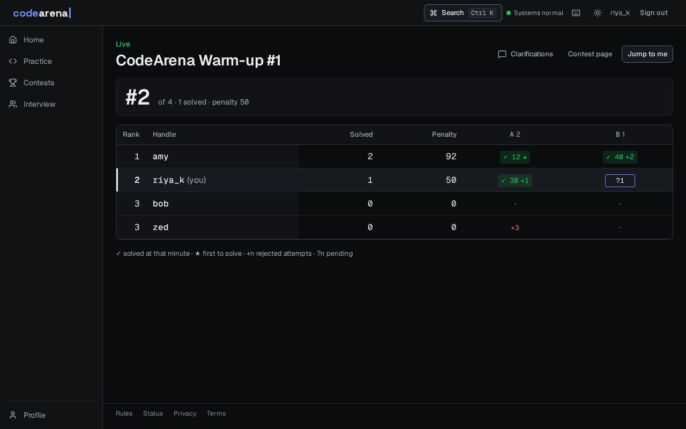
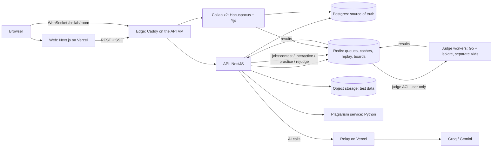

<div align="center">

# CodeArena

**An online judge and contest platform for campuses: sandboxed code execution, live ICPC-style contests, an AI coach that never hands out solutions, plagiarism review, and a collaborative interview pad.**

[](https://github.com/SoumiryaSarangi/CodeArena/actions/workflows/ci.yml)
[](https://github.com/SoumiryaSarangi/CodeArena/actions/workflows/codeql.yml)
[](https://github.com/SoumiryaSarangi/CodeArena/actions/workflows/nightly-attack.yml)

[Live site](https://code-arena-eta-mauve.vercel.app) · [Status](https://code-arena-eta-mauve.vercel.app/status) · [Documentation](#documentation) · [Metrics](docs/METRICS.md)



</div>

## Features

- **Judge.** C, C++, Java, Python and Node.js in an [isolate](https://github.com/ioi/isolate) sandbox on separate judge VMs: time, memory, process and output limits, no network, a sandboxed compile step, custom checkers, per-test results.
- **Contests.** ICPC scoring and freeze, a live board over Server-Sent Events, clarifications, an ICPC-style resolver ceremony, ratings, optional exam mode, rejudge tools.
- **Practice.** 20 problems with rendered maths, runnable samples and a submission page that shows each submission's journey from queue to verdict.
- **AI Coach.** A three-level hint ladder behind a guardrail pipeline; off during contests; post-contest reviews.
- **Fair play.** Plagiarism clusters (fingerprints plus code embeddings) for an administrator to review. Nothing is decided automatically.
- **Interview pad.** A real-time shared editor with roles, Run and Submit, private interviewer notes, a whiteboard, offline editing and a full session replay.
- **Operations.** Terraform on Azure, a deploy pipeline with automatic rollback, backups with a restore test, failure drills, OpenTelemetry traces and a public status page.

## Measured

Every number comes from a script in this repository; the caveats are in [`docs/METRICS.md`](docs/METRICS.md).

| What                                                          | Result                                                                                                             |
| ------------------------------------------------------------- | ------------------------------------------------------------------------------------------------------------------ |
| 500 submissions in 2 minutes, 200 browsers watching the board | 2 judge VMs: time to verdict p50 **0.4 s**, p95 **2.1 s**. One judge drained the queue in 58 s (estimated 15 min). |
| Failure drills (worker, API, Redis, judge VM, poison job)     | **6 of 6 pass on production**: every accepted submission judged exactly once.                                      |
| Sandbox attack suite                                          | **28 attack programs**, all contained, run nightly against a real judge VM.                                        |
| Interview pad, simulated typists                              | p95 edit propagation **2.1 ms** at 10 rooms × 3 (target 200 ms); nothing lost.                                     |
| Hint safety, 66-item eval                                     | **0 leaks in 54 hints** (the first prompt leaked 3.7 % and failed).                                                |
| Plagiarism, 3,476 labelled pairs                              | Held-out **92.1 % recall at 88.7 % precision** (independent solutions are AI-written).                             |

## Architecture



A submission is stored in Postgres and queued on a Redis stream by lane. A worker claims it with a lease, judges it in isolate and publishes the verdict; the API applies it idempotently, recomputes the board from Postgres and pushes the change to browsers over SSE. If a worker dies, a reaper re-delivers the job; after three failed deliveries it goes to a dead-letter queue.

Each decision, with its alternatives and costs, is an ADR in [`docs/adr/`](docs/adr/README.md), for example [untrusted judge hosts](docs/adr/009-untrusted-judge-hosts.md) and [Postgres as the source of truth](docs/adr/015-postgres-source-of-truth.md).

## Tech stack

| Layer      | Choices                                                                           |
| ---------- | --------------------------------------------------------------------------------- |
| Web        | Next.js (App Router), React, Tailwind CSS v4, shadcn/ui, Monaco                   |
| API        | NestJS, Drizzle ORM, Postgres, Redis, Zod validation, RFC 7807 errors             |
| Judge      | Go worker driving isolate 2.x on cgroup v2, Redis Streams with leases             |
| Real time  | Server-Sent Events (verdicts, boards); Hocuspocus (Yjs) WebSocket (interview pad) |
| Plagiarism | Python (uv), tree-sitter, winnowing, UniXcoder embeddings                         |
| Contracts  | Zod schemas generate JSON Schema and Go types; freshness checked in CI            |
| Infra      | Docker Compose, Terraform (Azure), Caddy, Grafana, OpenTelemetry, GitHub Actions  |
| Quality    | Vitest, Playwright with axe, Go and pytest suites, ESLint, CodeQL, Dependabot     |

## Getting started

**Requirements:** Linux or WSL2 (Ubuntu 24.04, `systemd=true` for isolate), Docker, Node.js 22+, pnpm 12, Go 1.26, and [uv](https://docs.astral.sh/uv/) for the plagiarism service.

```bash
pnpm install
scripts/dev-up.sh          # Postgres, Redis (three ACL users), object storage, OpenTelemetry collector
scripts/gen-keys.sh        # prints the access-token key pair for apps/api/.env
# copy each app's .env.example to .env and fill in the values (apps/api, apps/worker, ...)

sudo scripts/setup-isolate-wsl.sh && sudo scripts/setup-judge-runtimes.sh   # the sandbox (once)

pnpm db:reset                              # create the schema
pnpm problem:import --publish problems     # the 20 public problems
pnpm dev                                   # web, API, worker, collab, plagiarism
```

Web: <http://localhost:3000> · API: <http://localhost:4000>. Secrets are never committed, only the `.env.example` files. To be an administrator locally, set `OWNER_EMAIL` in `apps/api/.env` to the e-mail you sign in with.

## Development

```bash
pnpm check      # lint, typecheck, unit and integration tests, contract freshness
pnpm e2e        # Playwright browser tests (real Monaco, real collab servers, axe checks)
pnpm attack     # the sandbox attack suite (needs cgroup v2 and isolate)
pnpm contracts:gen   # regenerate JSON Schema and Go types from the Zod contracts
go test ./...   # in apps/worker;  uv run pytest  in apps/plag
```

Other scripts (load tests, failure drills, the hint eval, `ui-ux:sync`) are listed in [`package.json`](package.json) and the [runbooks](docs/runbooks/). Tests are named after the requirement they cover, for example `FR-BOARD-02`. A pre-commit hook (lefthook) formats and lints staged files.

## Repository layout

| Path                 | What                                                                   |
| -------------------- | ---------------------------------------------------------------------- |
| `apps/web`           | Next.js frontend                                                       |
| `apps/api`           | NestJS API: REST, SSE, queue, boards, AI, rooms                        |
| `apps/worker`        | Go judge worker controlling isolate                                    |
| `apps/collab`        | Hocuspocus (Yjs) server for the interview pad                          |
| `apps/plag`          | Python plagiarism service                                              |
| `packages/contracts` | Zod schemas: the source of truth for the API, JSON Schema and Go types |
| `infra/`             | Docker Compose, Terraform, cloud-init, Caddy, Grafana                  |
| `tests/`             | attack suite, chaos drills, load tests                                 |
| `problems/`          | the public practice problems                                           |
| `docs/`              | requirements, system design, ADRs, runbooks, metrics                   |

## Security

The judge runs hostile code, so its host is treated as hostile: workers run on separate VMs, hold no database credentials and reach Redis as an ACL user limited to job streams. Sandboxes have no network and an empty environment, and outputs are read with `O_NOFOLLOW`, `fstat` and a size cap. Sign-in is OAuth only, with short-lived tokens, rotating refresh cookies, CSRF protection and single-use realtime tickets. Hidden tests never enter this repository. Limits are stated plainly: exam mode is a deterrent, not proctoring, and plagiarism and AI signals are for a person to review. Details: [System design](docs/SYSTEM_DESIGN.md) and the [privacy page](https://code-arena-eta-mauve.vercel.app/privacy).

To report a vulnerability, please do not open a public issue: see [SECURITY.md](SECURITY.md).

## Deployment

The web app runs on Vercel; the API, collab servers, plagiarism service and Caddy run on an Azure VM, and judge workers on separate VMs, all described in Terraform. A green CI run on `main` triggers the deploy workflow, which rolls the services and rolls back on a failed health check. Runbooks: [contest day](docs/runbooks/contest-day.md) · [deploy](docs/runbooks/deploy.md) · [collab](docs/runbooks/collab.md) · [plagiarism](docs/runbooks/plagiarism.md) · [backup and restore](docs/runbooks/backup-restore.md) · [failure drills](docs/runbooks/failure-drills.md).

## Documentation

Start at the [documentation index](docs/README.md). The short list:

- [Product overview](docs/PRODUCT.md) · [PRD](docs/PRD.md) · [SRS](docs/SRS.md) · [UI/UX](docs/UI_UX.md)
- [Architecture](docs/ARCHITECTURE.md) · [System design](docs/SYSTEM_DESIGN.md) · [Architecture decisions](docs/adr/README.md)
- [Testing](docs/TESTING.md) · [Metrics](docs/METRICS.md) · [Roadmap and known limits](docs/ROADMAP.md)
- [Plan](docs/PLAN.md) · [Progress log](docs/PROGRESS.md) · [Changelog](CHANGELOG.md) · [Demo script](docs/DEMO.md)

## Status

The plan's critical path is built and deployed. The upgrade paths the design left out are written up in
[ADR-014](docs/adr/014-upgrade-paths.md); open items and known limits are in the [roadmap](docs/ROADMAP.md).

## Contributing

This is a personal project and is not taking outside pull requests right now; issues with a clear reproduction are
welcome. See [CONTRIBUTING.md](CONTRIBUTING.md) and the [code of conduct](CODE_OF_CONDUCT.md).

## License

[MIT](LICENSE) © 2026 Soumirya Sarangi.
