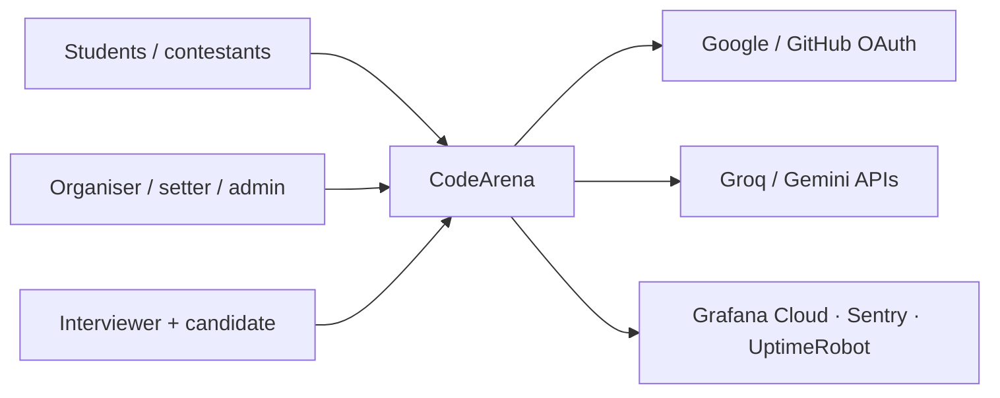
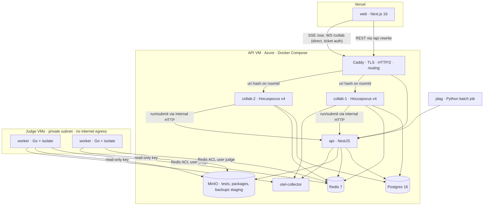
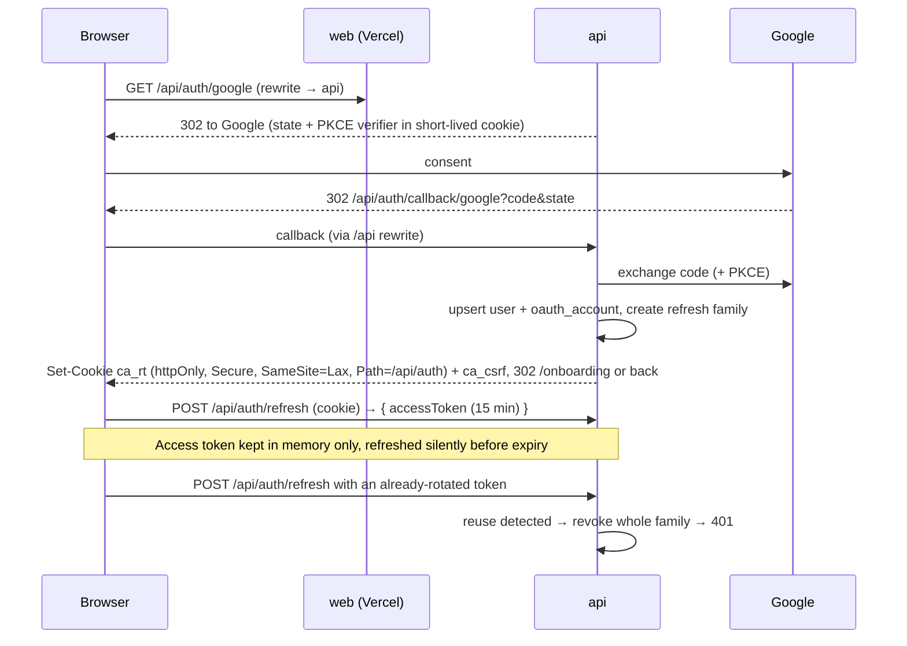
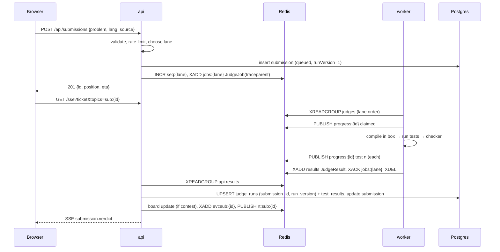
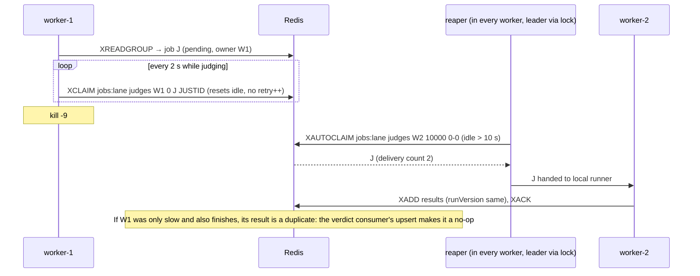
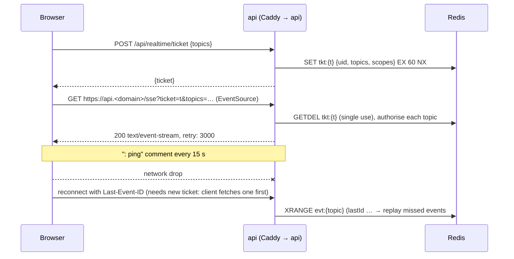
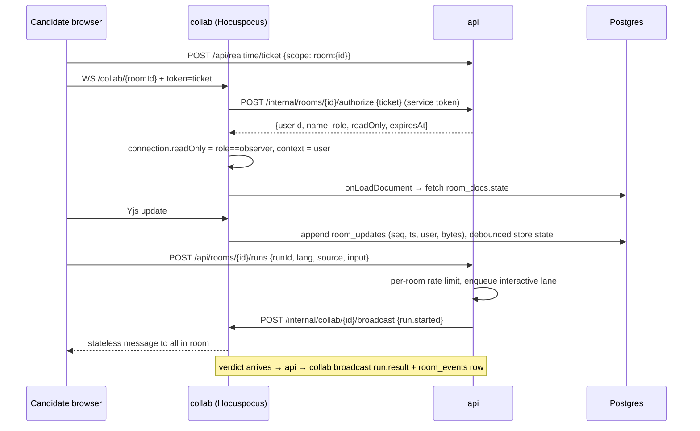
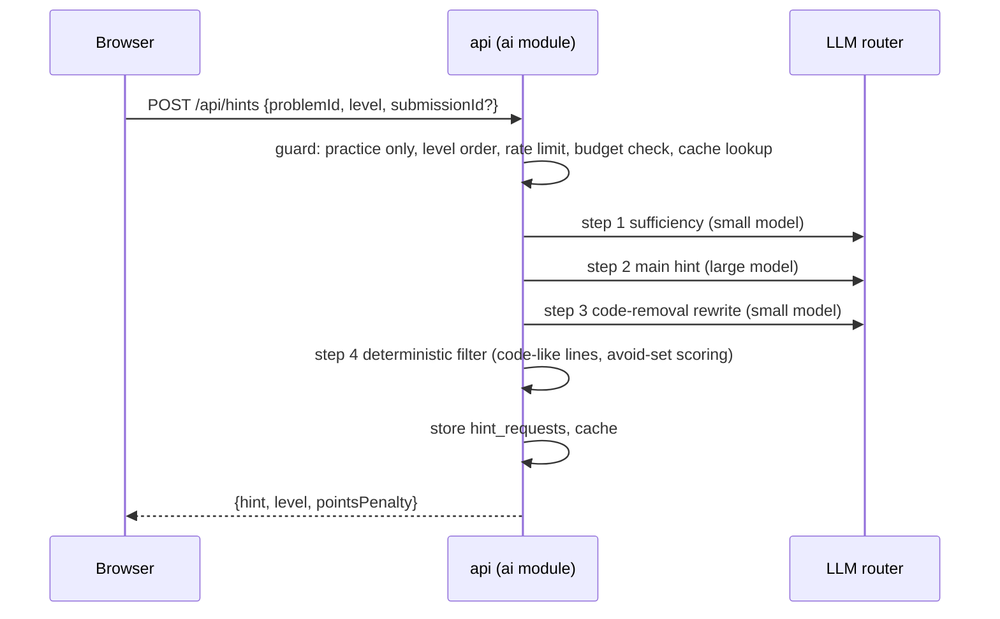

# CodeArena — System Design

| | |
|---|---|
| **Doc** | `docs/SYSTEM_DESIGN.md` · v1.0 · 30 Sep 2026 |
| **Owner** | Ayush · **Builder** Claude Code |
| **Companion docs** | `PRD.md` (what/why) · `SRS.md` (requirements, API) · `UI_UX.md` · `PLAN.md` (task cards, ADRs §4) |

> **For Claude Code:** sections are numbered `SD-§n`. Task cards in PLAN link here. Read only the section you need. Where this doc and PLAN disagree, this doc wins for *how*; PLAN wins for *when*. Locked decisions live in PLAN §4 and `docs/adr/`.

---

## §1. Goals and design principles

1. **Untrusted code is hostile.** Judge hosts are disposable, hold no secrets, and can't reach the network (Judge0 CVE lessons, research §4.1).
2. **Postgres is the truth; Redis is fast and rebuildable.** Any Redis loss is recoverable from Postgres.
3. **Pull, don't push.** Workers claim jobs; backpressure is natural; scale by adding workers.
4. **Exactly-once effects on at-least-once delivery.** Idempotency keys everywhere (`submissionId + runVersion`, `runId`).
5. **One contract, three languages.** Zod → JSON Schema → Go types (ADR-008).
6. **Observable by default.** Every request, job, and judge phase is a span; every queue has a depth metric.
7. **Boring where possible.** Standard components, documented upgrade paths for scale (ADR-014).

---

## §2. Key numbers and capacity estimates

### 2.1 Load assumptions

| Quantity | Realistic (Warm-up #1) | Design / burst test |
|---|---|---|
| Concurrent contestants | 20–60 | 200 |
| Submissions per contestant per contest | ~10 | ~10 |
| Peak submission rate | ~0.17/s (25% of 600 subs in last 15 min) | **500 in 2 min ≈ 4.2/s** (k6) |
| SSE connections | ≤ 60 | 200+ |
| Interview rooms | ≤ 10 | 25 (load test) |
| Problems per contest | 6 | 6 |
| Tests per problem | 20–60 | 100 |

### 2.2 Judge service time (per submission, CPU-seconds on one core)

| Language | Compile | Per-test run (typical) | 30 tests (AC) |
|---|---|---|---|
| C++ | ~1.5 s | ~50 ms | ~3 s |
| Python 3 | — | ~150 ms | ~4.5 s |
| Java | ~2 s | ~300 ms (JVM start dominates) | ~11 s |
| **Blended mean (S)** | | | **≈ 4 s** (failures stop early) |

Measure the real value in O-03 and replace this estimate in `METRICS.md`.

*As built (O-03):* the harness is `tests/load/` (driver, rehearsal and production runbook) plus `apps/api/src/modules/load/` (seed, report, cleanup of tagged fake data); `scripts/metrics-report.mjs` writes `docs/METRICS.md`. Service time per language is read from the journey stored with each verdict (`claimed` → verdict). Queue wait = worker claim − submit. Java is not measured: no package has a Java solution yet.

### 2.3 Throughput and queueing (Little's law: L = λW)

One judge VM has 2 vCPUs → 2 sandboxes → μ ≈ 2 / 4 s = **0.5 submissions/s**.

| Judges (cores) | Capacity μ | Realistic contest (λ=0.17/s) | Burst: backlog after 2 min | Burst: drain time (≈ worst wait) |
|---|---|---|---|---|
| 1 (2) | 0.5/s | utilisation 34%, waits ≈ seconds | 440 | ~15 min |
| 3 (6) | 1.5/s | 11% | 320 | ~3.5 min |
| 6 (12) | 3.0/s | — | 140 | ~47 s |
| 9 (18) | 4.5/s | — | 0 (μ > λ) | ≈ service time |

**Conclusions**
- Warm-up #1 needs 1 judge; on contest day run **4** (the steady judge + 3 added by `scale-judges.sh up 3`, PLAN §10) for headroom and fault tolerance (SLO: p95 time-to-verdict ≤ 15 s).
- The burst test proves correctness under overload (no loss, bounded memory, accurate ETA) and that drain time falls linearly with judges. It is *not* expected to meet the 15 s SLO with 3 judges. This is the honest interview answer: "sustained X/s; burst drained in Y s; adding judges scales linearly because the queue is pull-based."
- Everything else (API, Postgres, Redis, SSE) is far below its limits at this scale; the judge is the only bottleneck by design.

### 2.4 Storage

- Source ≤ 64 KB × a few thousand submissions → tens of MB.
- Tests ≤ 50 MB per problem in MinIO; judges cache by hash.
- Pad: update log ≈ 1–5 MB per 60-minute room (measure in CP-08).

---

## §3. Architecture (C4)

### 3.1 Context (level 1)



### 3.2 Containers (level 2)



### 3.3 Components (level 3)

**api (NestJS modules)**

| Module | Responsibility |
|---|---|
| `auth` | OAuth flows, JWT issue/verify, refresh rotation, CSRF, realtime tickets |
| `users` | Profiles, handles, settings, deletion |
| `problems` | Problems, versions, packages, validation runs, statements |
| `submissions` | Create, list, detail, custom runs, queue position |
| `queue` | Enqueue (lanes, seq), verdict consumer, reaper, DLQ admin |
| `contests` | Contests, registration, visibility, clock, clarifications, announcements |
| `board` | Leaderboard engine, freeze, resolver state, rebuild |
| `ratings` | Rating computation on finalise |
| `realtime` | SSE gateway, topics, replay buffers, Redis pub/sub bridge |
| `ai` | Provider router, budgets, prompts, hint pipeline, reviews, room summaries |
| `integrity` | Plagiarism run ingestion, clusters, decisions, editor signals |
| `rooms` | Rooms, invites, notes, snapshots, playback data, internal run endpoint for collab |
| `admin` | Ops console data, rejudge, audit log |
| `status` | Public status metrics (cached) |
| `events` | Product analytics ingestion |
| `health` | Liveness/readiness |

**worker (Go packages):** `cmd/worker` · `internal/queue` (claim, lease, ack, reaper) · `internal/sandbox` (box pool, isolate command builder, meta parser, safe reader) · `internal/lang` (registry) · `internal/checker` · `internal/tests` (cache) · `internal/judge` (pipeline, verdict engine) · `internal/telemetry` · `internal/contracts` (generated).

**collab (Hocuspocus v4, Node 22+):** server config + extensions: `auth` (onAuthenticate, onTokenSync, beforeHandleMessage), `awarenessStamp` (beforeHandleAwareness), `Database` (fetch/store), `Redis`, `updateLog` (onChange → room_updates), `events` (stateless → room_events), `limits` (doc size, session length).

---

## §4. Repository and module boundaries

See PLAN §6.1 for the tree. Rules:
- `apps/*` never import from each other; shared types only via `packages/contracts`.
- API modules talk through services, never another module's repository.
- The worker depends only on `internal/contracts` generated code for message shapes.

---

## §5. Key flows (sequence diagrams)

### 5.1 Sign-in and token refresh



### 5.2 Submit → verdict (happy path)



Progress events from the worker are relayed by the API's `progress:*` subscriber into `evt:sub:{id}` so they're replayable.

### 5.3 Worker dies mid-judge (lease expiry)



- Heartbeat refresh uses `XCLAIM … JUSTID`, which resets the entry's idle time without incrementing the delivery counter (Redis docs).
- `XAUTOCLAIM` claims entries idle longer than `min-idle-time`, resets their idle time, and increments the delivery count unless `JUSTID` is given (the reaper does **not** use JUSTID so the count grows).
- Entries deleted from the stream are dropped from the PEL by `XAUTOCLAIM`, which is why jobs are only `XDEL`-ed after `XACK`.
- **As built (Q-02, ADR-005):** no leader lock (outside the judge ACL); each worker scans `XPENDING … IDLE 10000` and takes stale entries with a min-idle `XCLAIM` (atomic per entry, delivery counted), which also reveals the previous owner. A missing `hb:{owner}` counts a crash in `jobs:crashes`; two crashes quarantine the job, more than 3 deliveries dead-letter it, both with an SE verdict. A worker that finds its entry owned by someone else cancels judging and publishes nothing.

### 5.4 Rejudge

Admin → `POST /api/admin/rejudge {scope}` → for each submission: `runVersion += 1`, status `queued`, enqueue in `rejudge` lane (or `contest` lane when urgent) → consumer upserts by the new runVersion; the submission's *current* verdict is the one with the highest completed runVersion → board recomputed for affected users → audit log entry.

### 5.5 Leaderboard update

On a contest submission's final verdict:
1. Load cell `board:{cid}:cells` field `{uid}:{label}` (attempts, acMinute, pending).
2. Apply rules (§9.1): if already solved → ignore; if AC → set acMinute, recompute user's (solved, penalty, lastAc) → `ZADD board:{cid}` new score; if rejected (not CE unless configured, not SE) → attempts++.
3. If `now ≥ freeze_at` and viewer isn't the owner/admin → public diff says "pending" instead of the verdict; `board:{cid}:frozen` unchanged.
4. First AC on a problem → `HSETNX first:{cid} {label} {uid}`.
5. Publish `board.diff` to `rt:contest:{cid}:board` (coalesced to ≤ 2/s).
All steps run in one Lua script per update for atomicity.
- *As built (C-02):* the incremental rules above give wrong answers when verdicts arrive out of order (an earlier WA judged after a later AC would be ignored) and cannot undo a rejudge or a disqualification. So every update **recomputes the whole (user, problem) cell from Postgres**: all of that user's submissions on that problem in the contest, in submission order, through one pure function (`apps/api/src/modules/board/scoring.ts`). A Lua script then stores the cell (live and frozen view) and recomputes the user's two row scores from all their cells atomically. Triggers: a contest submission is created (pending), a verdict is stored (`ResultsProcessor`, after the commit), a rejudge or disqualification (`BoardService.update`), a registration (zero row). The read-then-write of a cell runs in a short Postgres transaction holding `pg_advisory_xact_lock_shared(board:{cid})` and `pg_advisory_xact_lock(cell:{cid}:{uid}:{label})`, so the last write has always read the latest committed state; a rebuild takes the contest lock exclusively. Board failures never fail a verdict or a submit: they are logged, counted (`ca_board_update_failures_total`, as `ca_board_updates_total{outcome=error}`), and retried at 1, 3 and 10 s. First solves and solve counts are derived from the cells when read (the earliest AC by submission time), so `first:{cid}`/`solved:{cid}` are not stored and stay right after a rejudge. Diffs: after an update `SET board:{cid}:flush NX PX 500`; the winner publishes the changed rows 500 ms later as `board.diff` `{contestId, version, frozen, rows}` (rows carry the packed `score`; clients re-rank) to `contest:{cid}:board` (the public view, frozen during the freeze) and `admin:contest:{cid}:board` (live). No timer runs at the freeze: the frozen view is maintained all along from the `after_freeze` flag, and readers switch by the server clock.

### 5.6 Freeze and resolver

- At `freeze_at`: `COPY board:{cid} board:{cid}:frozen`; public board reads `:frozen` + per-cell pending counters.
- Resolver (admin-driven, state in `resolver:{cid}`):
  1. Start from the frozen ranking.
  2. Repeat: pick the lowest-ranked row that still has pending cells; reveal its leftmost pending cell (apply the true result); if it becomes solved, re-sort (row may move up); emit `board.resolve.step`.
  3. When no pending cells remain, the board equals `board:{cid}` (assert in test C-06).
- Steps are deterministic and replayable from the submissions table.
- *As built (C-02):* there is no `COPY` at `freeze_at`. `board:{cid}:frozen` and `board:{cid}:frozen:cells` are kept up to date with every update, computed from the same submissions with every attempt made after the freeze shown as pending. Non-admins read them from `freeze_at` until the contest is finalized; a signed-in contestant sees their own cells live in place of the frozen ones (rank and totals stay frozen; FR-BOARD-05).

- *As built (C-06):* the resolver is a pure function in the web app (`apps/web/lib/resolver.ts`), not server state: the admin's browser reads the frozen view (`?view=frozen`) and the live view and walks one to the other, bottom rank first and leftmost cell first, with the packed score recomputed per step. Nothing is written to `resolver:{cid}`. It is deterministic, so a replay gives the same sequence, and its end equals the live board (tested on 200 random contests).

### 5.7 Realtime connection



### 5.8 Pad connect, edit, run



### 5.9 AI hint pipeline



---

## §6. Data design

### 6.1 Conventions

- IDs: UUIDv7 (time-ordered) for all primary keys.
- Timestamps `timestamptz`, UTC in storage; UI renders IST by default.
- Enums as Postgres enums (created in migrations).
- Soft delete only for users (`deleted_at`); everything else hard-deletes or is immutable.

### 6.2 Schema (Drizzle; columns abbreviated where obvious)

```sql
-- identity
users(id uuid pk, handle citext unique not null, name text, email citext unique not null,
      avatar_url text, role user_role not null default 'user', rating int not null default 1400,
      default_language text, created_at, deleted_at)
oauth_accounts(id uuid pk, user_id fk, provider oauth_provider, provider_user_id text,
      unique(provider, provider_user_id))
refresh_tokens(id uuid pk, user_id fk, family_id uuid, token_hash bytea unique,
      created_at, expires_at, revoked_at, replaced_by uuid, user_agent text)
      index(user_id), index(family_id)

-- problems
problems(id uuid pk, slug text unique, title text, difficulty int, visibility problem_visibility,
      current_version_id uuid, author_id fk, practice_points int, created_at)
problem_versions(id uuid pk, problem_id fk, version int, statement_md text, editorial_md text,
      limits jsonb /* {timeMs, memMb, outputKb, wallMultiplier} */,
      checker jsonb /* {kind:'exact'|'tokens'|'float'|'testlib', eps?, sourceUri?} */,
      testset_hash text, testset_uri text, tests_count int, samples jsonb,
      validation_status validation_status, validated_at, created_by fk, created_at,
      unique(problem_id, version))
problem_tags(problem_id fk, tag text, pk(problem_id, tag))
package_solutions(id uuid pk, version_id fk, name text, language text, expected_verdict verdict, source_uri text)
validation_runs(id uuid pk, version_id fk, status run_status, results jsonb, created_at, finished_at)

-- judging
submissions(id uuid pk, user_id fk, problem_version_id fk, contest_id fk null, language text,
      source text, source_bytes int, lane lane, status submission_status, verdict verdict null,
      time_ms int, mem_kb int, failed_test int, current_run_version int not null default 1,
      contest_minute int, after_freeze bool default false, disqualified bool default false,
      created_at, judged_at)
      index(user_id, created_at desc), index(contest_id, created_at), index(problem_version_id, verdict)
judge_runs(id uuid pk, submission_id fk, run_version int, reason run_reason, worker_id text,
      started_at, finished_at, verdict verdict, time_ms int, mem_kb int, compile_log text,
      unique(submission_id, run_version))
test_results(judge_run_id fk, test_no int, verdict verdict, time_ms int, mem_kb int,
      checker_msg varchar(256), pk(judge_run_id, test_no))
custom_runs(id uuid pk, user_id fk, room_id fk null, problem_version_id fk null, language text,
      source text, input text, status run_status, result jsonb, created_at)  -- purge after 7 days

-- contests
contests(id uuid pk, slug text unique, title text, starts_at, ends_at, freeze_at null,
      rules jsonb /* {penaltyMinutes:20, ceCountsAsAttempt:false, langMultipliers, rated, lateRegistration} */,
      status contest_status, created_by fk, finalized_at)
contest_problems(contest_id fk, label char(1), problem_id fk, version_id fk, position int,
      pk(contest_id, label))
participants(contest_id fk, user_id fk, registered_at, final_rank int, pk(contest_id, user_id))
clarifications(id uuid pk, contest_id fk, problem_label char(1) null, asker_id fk, question text,
      answer text, answered_by fk, is_public bool, created_at, answered_at)
announcements(id uuid pk, contest_id fk, body text, created_by fk, created_at)
rating_changes(contest_id fk, user_id fk, old_rating int, new_rating int, delta int,
      seed numeric, rank int, pk(contest_id, user_id))

-- AI
hint_requests(id uuid pk, user_id fk, problem_id fk, level smallint, submission_id fk null,
      prompt_version text, models jsonb, tokens_in int, tokens_out int, response text,
      leak_flag bool, blocked_reason text, helpful bool null, created_at)
reviews(id uuid pk, user_id fk, contest_id fk, problem_id fk, submission_id fk, status review_status,
      content_md text, prompt_version text, model text, tokens int, created_at, ready_at,
      unique(submission_id))

-- integrity
plag_runs(id uuid pk, contest_id fk, params jsonb, status run_status, metrics jsonb, started_at, finished_at)
plag_pairs(run_id fk, problem_id fk, sub_a uuid, sub_b uuid, fp_score real, emb_score real,
      combined real, pk(run_id, sub_a, sub_b))
plag_clusters(id uuid pk, run_id fk, problem_id fk, submission_ids uuid[], max_score real)
review_decisions(id uuid pk, cluster_id fk, decision decision_kind, note text not null,
      reviewer_id fk, created_at)
editor_signals(id bigserial pk, user_id fk, contest_id fk, problem_id fk, kind signal_kind,
      size int, at timestamptz)  -- purge 30 days after contest end

-- interview pad
rooms(id uuid pk, owner_id fk, problem_id fk null, language text, duration_min int,
      status room_status, created_at, closed_at, doc_bytes int)
room_members(room_id fk, user_id fk, role room_role, joined_at, pk(room_id, user_id))
room_invites(id uuid pk, room_id fk, role room_role, token_hash bytea unique, expires_at, revoked_at)
room_docs(room_id pk fk, state bytea, updated_at)
room_updates(room_id fk, seq bigint, ts timestamptz, user_id fk, update bytea, pk(room_id, seq))
room_checkpoints(room_id fk, seq bigint, state bytea, pk(room_id, seq))
room_events(room_id fk, seq bigint, ts, user_id fk, kind room_event_kind, payload jsonb)
room_snapshots(id uuid pk, room_id fk, seq bigint, label text, snapshot bytea, created_at)
interviewer_notes(room_id pk fk, author_id fk, body_md text, updated_at)
room_summaries(room_id pk fk, content_md text, model text, created_at)

-- platform
product_events(id bigserial pk, user_id fk null, name text, props jsonb, at)  index(name, at)
audit_log(id bigserial pk, actor_id fk, action text, target_type text, target_id text, meta jsonb, at)
```

### 6.3 State machines

```
Submission:  queued ──claim──▶ judging ──result──▶ done
                 ▲                 │                 │
                 └──── retry ◀─────┘ (lease expiry)  └── rejudge (runVersion+1) ──▶ queued
             judging ── deliveries > 3 ──▶ failed (verdict SE, DLQ)

Contest:     draft ─publish▶ scheduled ─(starts_at)▶ running ─(ends_at)▶ ended ─finalize▶ finalized
             (running/ended derived from server time; status column updated by a scheduler for queries)

Validation:  pending ▶ running ▶ passed | failed          Room: open ▶ closed ▶ archived
Review:      pending ▶ ready | failed                     Plag run: queued ▶ running ▶ done | failed
```

### 6.4 Retention

| Data | Retention |
|---|---|
| editor_signals | 30 days after contest end |
| custom_runs | 7 days |
| room_updates / checkpoints | 90 days after room close (then compacted to final state) |
| Logs (Grafana Cloud) | 14 days (free tier) |
| Everything else | Until account deletion (anonymised in standings) |

---

## §7. Redis keyspace

| Key | Type | TTL | Writer → Reader | Purpose |
|---|---|---|---|---|
| `jobs:{lane}` | stream (group `judges`) | none; `XDEL` after ack | api → worker | Judge jobs per lane |
| `jobs:dlq`, `jobs:quarantine` | stream | none | worker/api → admin | Failed / poison jobs |
| `results` | stream (group `api`) | trimmed `MINID` older than 1 h after ack | worker → api | Judge results |
| `seq:{lane}` | string | none | api | Per-lane job counter (`INCR` and `XADD` in one Lua script at enqueue, so counter order = stream order); stamps `JudgeJob.seq`. The API's `api` ACL user needs `EVAL` on `seq:*` and `jobs:*` (Q-04) |
| `ewma:svc:{lane}` | string | none | api (progress bridge) | Service-time EWMA for ETA |
| `lock:bridge` | string | 5 s lease | api | Leader of the progress bridge (Q-05) |
| `pclaim:{id}` | string | 10 min | api | When a judge claimed a job (for the EWMA) |
| `sub:entry:{id}` | string | 1 h | api | `lane:entryId` of a queued job (queue position, S-01) |
| `idem:{scope}:{uid}:{key}` | string | 10 min | api | `Idempotency-Key` result (S-01) |
| `hb:{workerId}` | string (JSON) | 10 s | worker | Heartbeat |
| `progress:{submissionId}` | pub/sub | — | worker → api | Per-test progress |
| `evt:{topic}` | stream `MAXLEN ~ 2000` | 5 min idle expiry | api → api | SSE replay buffer |
| `rt:{topic}` | pub/sub | — | api → all api instances | SSE fan-out |
| `tkt:{ticket}` | string | 60 s | api | Realtime ticket (single use via `GETDEL`) |
| `board:{cid}` / `board:{cid}:frozen` | zset | 30 days | api | Leaderboard (userId → packed score), live and frozen view |
| `board:{cid}:cells` / `board:{cid}:frozen:cells` | hash | 30 days | api | Cell state `{uid}:{label}` → `{a, m, t, p}` (attempts, AC minute, AC submission time, pending) |
| `board:{cid}:ver`, `board:{cid}:dirty`, `board:{cid}:flush` | string, set, string | 30 days, 30 days, 500 ms | api | Board version (diffs), users changed since the last diff, diff lease (C-02). First solves and solve counts are derived from the cells, not stored |
| `resolver:{cid}` | hash | 7 days | api | Resolver progress |
| `rl:{scope}:{id}` | hash | window | api | Token-bucket rate limits |
| `ai:jobs` | stream | none | api | AI reviews / summaries |
| `ai:budget:{model}:{yyyymmdd}` | hash | 48 h | api | Token/request ledger |
| `ai:cache:{sha256}` | string | 7 d | api | Hint cache |
| `lock:{name}` | string | lease | any | Singleton jobs (`SET NX PX`): `lock:bridge` (Q-05), `lock:reconciler` (Q-03b) |
| `recon:cool:{id}`, `recon:attempts` | string, hash | stuck period, 24 h | api | Reconciler attempt spacing and count (Q-03b) |
| Hocuspocus Redis extension keys | managed | — | collab | Cross-instance sync |

_Queue position (decision, J-05):_ the judge user may only `SET hb:*` (ADR-009), so there is no `claimed:{lane}` key. The API derives position from the stream itself: jobs ahead in a lane = entries between the group's `last-delivered-id` (`XINFO GROUPS`) and the job's own entry id, counted with `XRANGE … COUNT` (capped; beyond the cap it shows "100+"), plus the same figure for every higher lane (FR-QUEUE-08). This keeps a compromised judge from lying about queue state and needs no extra ACL.

_Custom runs (decision, J-05):_ a job with `mode: run` and `customInput` runs the source once on that input with no checker; the result's `output` and `stderr` (≤ 64 KB each) are set only for these runs, and the verdict says how the run ended (AC = ran to completion). Problem tests never return program output.

_Wire format (J-05):_ a `jobs:{lane}` entry has one field, `job`, holding the `JudgeJob` JSON; a `results` entry has one field, `result`, holding the `JudgeResult` JSON; `jobs:dlq` entries carry `job`, `reason` (`invalid-job` or `execution-failed`), `error`, `workerId`, `lane`, `entry`, `ts`. `hb:{workerId}` holds `{workerId, lane, ts, busy, concurrency}`; `progress:{submissionId}` carries `JudgeProgress` JSON. The consumer name is the worker id, and a restarted worker resumes its own unacknowledged entries first. A testlib checker's `sourceUri` points at the checker's C++ **source** under `checkers/` (compiled on each judge, SD-§8.5).

---

## §8. Judge engine

### 8.1 Pipeline

```
claim job ─▶ ensure testset cached (hash) ─▶ init compile box ─▶ compile (sandboxed)
  └─ CE? ─▶ result CE (compile log ≤ 16 KB)
  └─ ok ─▶ init run box (same core) ─▶ for each test (ordered):
            copy input into box (host writes only into fresh box dir, O_EXCL)
            isolate --run … < input > out  (meta file)
            read out safely (O_NOFOLLOW, fstat regular, size cap)
            map meta → verdict; if OK → run checker (in its own box) → verdict
            publish progress; stop on first failure if stopOnFirstFailure
         ─▶ cleanup boxes ─▶ publish result ─▶ XACK + XDEL
```

### 8.2 isolate invocation (run step)

```
isolate --box-id=<core> --cg --init
isolate --box-id=<core> --cg --run \
  --meta=<metafile> --time=<T> --extra-time=0.5 --wall-time=<3T+1> \
  --cg-mem=<MEM_KB> --processes=<P> --fsize=<OUTPUT_KB> --stack=<STACK_KB> \
  --open-files=64 --env=PATH=/usr/bin:/bin --stdin=in.txt --stdout=out.txt --stderr=err.txt \
  --dir=/usr/lib/jvm --dir=… (language runtime dirs only, read-only) \
  -- <run command>
isolate --box-id=<core> --cg --cleanup
```

- Network is off by default (isolate creates a fresh network namespace with only loopback); never pass `--share-net`.
- `T` = problem time limit × language multiplier. Wall time guards sleeping programs.
- Box directories are created by isolate; the host never follows paths inside them except via the safe reader.
- Each box is pinned to a dedicated core (`taskset` on the isolate invocation) for timing fairness.

### 8.3 Language registry (`apps/worker/languages.yaml`)

_Implemented as `apps/worker/internal/languages/languages.yaml` (embedded with `go:embed`, which cannot reach a parent directory). Tool paths are absolute because isolate does not search PATH._

| id | Compile | Run | Processes | Memory overhead allowance |
|---|---|---|---|---|
| `c` | `gcc -O2 -std=c17 -static -o main main.c -lm` | `./main` | 1 | 0 |
| `cpp17` / `cpp20` | `g++ -O2 -std=c++17/20 -static -o main main.cpp` | `./main` | 1 | 0 |
| `python3` | `python3 -m py_compile main.py` (syntax check → CE) | `python3 main.py` | 1 | 16 MB |
| `java21` | `javac -encoding UTF-8 Main.java` | `java -Xss64m -XX:+UseSerialGC -Xmx<MEM> Main` | 32 | 64 MB |
| `node` | `node --check main.js` | `node --stack-size=65500 main.js` | 16 | 48 MB |

Compile limits: 10 s CPU, 512 MB, output 1 MB, 64 processes (javac needs threads).

### 8.4 Verdict mapping

| Condition (from meta / checker) | Verdict |
|---|---|
| Compile step non-zero exit or killed | CE |
| `status:TO` (time or wall time exceeded) | TLE |
| `cg-oom-killed` present | MLE |
| Output file hit `--fsize` (SIGXFSZ) or stdout > limit | OLE |
| `status:SG` (signal) or `status:RE` (non-zero exit) | RE (signal name shown) |
| `status:XX` (sandbox internal error) | SE (retry, then DLQ) |
| Exit 0 → checker `_ok` (exit 0) | AC |
| Checker `_wa` (1) or `_pe` (2) | WA (PE merged into WA, like Codeforces) |
| Checker `_fail` (3) | SE + alert "checker failed" (jury error) |
| Checker partial `_pc` | WA (partial scoring out of scope, NG2) |

Reported time = meta `time` (CPU time of the whole control group). Reported memory = meta `cg-mem` (whole group, KB). Note: `cg-mem` can be lower than `max-rss` because shared pages (libc, JVM) are accounted differently; the limit is enforced by the cgroup either way.

### 8.5 Checkers

| Kind | Rule |
|---|---|
| `exact` | Byte-equal after normalising trailing whitespace at line ends and final newline |
| `tokens` (default) | Whitespace-separated tokens equal |
| `float:eps` | Tokens equal, numeric tokens within absolute or relative error `eps` |
| `testlib` | `checker <input> <output> <answer>`; exit code decides (0 OK, 1 WA, 2 PE, 3 FAIL); message ≤ 256 chars stored |

Custom checkers are compiled once per problem version on each judge (cached by hash) and run inside a box.

### 8.6 Test cache

- Path: `/var/cache/codearena/tests/<testsetHash>/{NN.in,NN.ans}`, owned by a non-root user, mode 0440.
- Download from MinIO with a read-only key; verify SHA-256 of the tar before extracting (tar extraction rejects absolute paths and `..`).
- LRU eviction when the cache exceeds 5 GB.

### 8.7 Timing fairness

- Same VM size for every judge; one box per core; boxes pinned.
- A calibration program runs at worker start; its time is exported as a metric. If a judge's calibration deviates > 15% from the fleet median, it marks itself unhealthy and stops claiming.

---

## §9. Contests, leaderboard, ratings

### 9.1 Scoring rules — see PRD §9.1.

### 9.2 Composite score packing

Redis sorted-set scores are IEEE-754 doubles, exact for integers < 2^53. We pack three fields into one integer:

```
S = solved            (0 … 26)
P = penalty minutes   (0 … 131071, capped; 2^17 − 1)
T = last AC minute    (0 … 1023;  contests ≤ 1023 minutes)

score = S · 2^27 + (2^17 − 1 − P) · 2^10 + (1023 − T)
```

Higher is better (`ZREVRANGE`). Max value = 26·2^27 + 2^27 − 1 ≈ 3.6 × 10^9 ≪ 2^53. Rejected attempts counted per problem are capped at 99 so `P ≤ 26 × (1023 + 20 × 99) = 78,078 < 131,071`. Unit test asserts the bounds and ordering (C-02).

Equal scores share a rank: rank = 1 + number of rows with a strictly greater score (`ZCOUNT key (score +inf`).
- *As built (C-02):* the 17-bit penalty holds only if `penaltyMinutes ≤ 40` (26 · (1023 + 40 · 99) = 129,558 < 131,071), so `ContestRules.penaltyMinutes` is limited to 0–40, and a contest may last at most 1023 minutes (`MAX_CONTEST_MINUTES`) so T fits its 10 bits. `scoring.test.ts` proves the maximum is below 2^53 and, with fast-check, that score order equals the ICPC comparator for any two results.

### 9.3 Board rebuild

`rebuildBoard(cid)`: delete keys → replay all contest submissions ordered by `created_at` through the same pure function used live → write ZSET/hash → if frozen, rebuild `:frozen` from submissions before `freeze_at`. Property test: live board == rebuilt board for random sequences.
- *As built (C-02):* `BoardService.rebuild` computes every cell and row with the same functions, writes them under temporary names and swaps them in with `RENAME` in one `MULTI`, so a reader never sees an empty board; a board that has gone missing (expired, Redis flushed) is rebuilt on the next read or update. `POST /api/admin/contests/{id}/rebuild-board` (admin). The property test (`board.test.ts`) drives random contests through the real `ResultsProcessor` with shuffled and repeated verdicts, rejudges and disqualifications and checks the ZSET ranking against an independently written reference from Postgres, for the live and the frozen view, then checks a rebuild changes nothing.

### 9.4 Freeze and resolver — see §5.6.

### 9.5 Rating (C-08)

Deterministic implementation of the Codeforces-style algorithm (PRD §9.4):
1. For each participant compute `seed_i = 1 + Σ_j P(j beats i)` using ratings before the contest.
2. `m_i = sqrt(seed_i × rank_i)`; binary-search rating `R` in [−4000, 8000] such that seed with rating `R` ≈ `m_i`; `d_i = (R − r_i) / 2`.
3. Anti-inflation: `inc = −Σd_i / n − 1`, add to all; then for the top `min(n, 4√n)` by pre-contest rating, `inc2 = min(max(−Σd_top / s, −10), 0)`, add to all.
4. Round; store in `rating_changes`; update `users.rating`.
Test: identical inputs → identical outputs; sum of deltas ≤ 0.
- *As built (C-08):* `apps/api/src/modules/ratings/ratings.ts` is a pure function. Players are sorted by id before any sum, the binary search runs exactly 100 halvings, and the output is rounded, so the same field gives the same numbers in any input order. Tied players share the middle of the places they occupy (a tie of ranks 3–4 counts as 3.5), which is the Codeforces treatment. The seed uses `P(j beats i)` for every other player. `inc` and `inc2` are as above, with `top = min(n, round(4√n))`, and the tie-break for "top by rating" is the id. **Who is rated:** registered participants with at least one submission that is not disqualified (a registered user who never submitted is not in the field), ranked among themselves by the packed board score; the board is rebuilt from the database first so the standings are what the submissions say. **Finalising** (`POST /admin/contests/{id}/finalize`) needs an ended contest and runs once: in one transaction it sets `status = finalized` (the board stops being frozen for everyone), and for a rated contest with at least 5 such participants inserts `rating_changes` (old, new, delta, seed, rank) and updates `users.rating` (rows locked in id order). **Recompute** (`POST .../recompute-ratings`) starts from the stored `old_rating`, takes the standings again, rewrites the rows and moves a user's current rating only if it is still the one this contest gave them (a later contest is not undone); with unchanged submissions it changes nothing. Not done here: queueing AI reviews on finalise (the AI cards) and moving problems to practice (already follows from the contest being over, FR-PROB-09).

---

## §10. Realtime (SSE)

- **Transport:** SSE over HTTP/2 through Caddy (avoids the browser's 6-connections-per-domain limit that applies to SSE over HTTP/1.1). One `EventSource` per tab carrying multiple topics.
- **Envelope:** `id: <evt stream id>` · `event: <type>` · `data: {"topic","type","ts","data"}`.
- **Types:** `submission.progress`, `submission.queue`, `submission.verdict`, `board.snapshot`, `board.diff`, `board.freeze`, `board.resolve.step`, `clar.new`, `clar.answer`, `announce.new`, `contest.state`, `review.ready`, `sys.status`.
- **Authorisation per topic:** `sub:{id}` owner or admin · `contest:{id}:*` registered or public board · `admin:*` admin · `sys` anyone.
- **Resume:** replay from `evt:{topic}` after `Last-Event-ID`; if the ID is older than the buffer, send `board.snapshot` / full state instead.
- **Heartbeat:** comment every 15 s; `retry: 3000`.
- **Fan-out:** every API instance subscribes to `rt:*` it has clients for; publishing is decoupled from delivery.
  - *As built (Q-03):* the `rt:{topic}` message is `{"id": "<evt stream id>", "envelope": {topic, type, ts, data}}`, so a subscriber can send the SSE `id:` without reading the stream. `submission.verdict` data is `SubmissionVerdictData` (contracts).
  - *As built (Q-05):* `GET /sse?ticket=&topics=a,b` redeems the ticket (single use) and refuses topics it was not issued for (401). The stream starts with `retry: 3000`, then `: ping` every 15 s. **Resume:** `Last-Event-ID` (header) replays `evt:{topic}` after that id; the hub subscribes to `rt:` first, then reads the replay, then flushes live events, and drops any id it already sent, so nothing is lost or doubled. Ids are compared as stream ids across all topics of a connection (one `Last-Event-ID` covers them; fine for the usual one-topic-per-submission case). A client with **no** `Last-Event-ID` still catches up on `sub:` topics from the buffer. If the buffer is gone (5 min idle) or starts after the client's id, a finished submission is sent as a **snapshot** `submission.verdict` without an `id:` so it cannot move the client's cursor. At most 20 topics per connection and 5 connections per user (the oldest is closed).
  - *Progress bridge:* workers can only publish to `progress:{id}` (ADR-009), so one API instance at a time (a lease on `lock:bridge`, 5 s, renewed every third; released on shutdown) subscribes `progress:*` and copies each message into `evt:sub:{id}` + `rt:sub:{id}` as `submission.progress`. A single writer keeps event ids in the order the worker published; if it dies another instance takes over within one lease (progress in the gap is lost, the verdict is not).
  - *Queue events:* `submission.queue` `{submissionId, lane, position, etaSeconds, capped}` is **live only** (no `id:`, never replayed): every 2 s each instance checks the queued submissions its clients watch and sends when the numbers changed, and once with position 0 when a judge takes the job. A reconnecting client reads `GET /api/submissions/{id}/position`.
  - *ETA:* position × `ewma:svc:{lane}` ÷ live judges (`hb:*`), as in FR-QUEUE-08. The bridge writes the EWMA (α = 0.2) from `claimed` → `done` progress timestamps; a cold start assumes 3 s.
  - *Shutdown:* the hub closes its streams in `onModuleDestroy` (before the HTTP server closes): an event stream never ends by itself and would otherwise stall a graceful shutdown.
  - *Browser client (UI-02):* `EventSource` reconnects by itself but would reuse the URL, and a ticket is single use, so the client (`apps/web/lib/realtime.ts`) closes the source on any error, fetches a **new ticket**, and reopens with the last event id as `lastEventId`, with back-off 1 s to 15 s plus jitter. A run's verdict is watched on `sub:{runId}` (the ticket check accepts the caller's own custom runs as well as submissions). The access token lives in memory only; the httpOnly refresh cookie renews it (`apps/web/lib/api.ts`), and a refused refresh marks the visitor a guest for 30 s instead of retrying on every request.
  - *Journey (UI-03, US-3.3):* progress events live only minutes in `evt:sub:{id}`, so when the verdict is stored `ResultsProcessor` reads that buffer, takes the first time of each phase (`claimed`, `compiling`, `running`, `done`) **for that run version**, and keeps `{steps:[{phase, at}]}` in `judge_runs.journey` in the same transaction. Missing events (bridge off, Redis down) give a shorter or empty list, never a failure. The detail endpoint returns them as ISO `journey.steps`; the page builds "claimed by judge-2 · compiled in 1.6 s · tests · verdict published" from them and says so when nothing was recorded. Admins also get `runs` (every judging run).
- **Backpressure:** per-connection write buffer cap 256 KB; slow clients are disconnected and resume via replay.

---

## §11. Collaborative pad

### 11.1 Documents

- One Y.Doc per room, name `room:{roomId}`, `gc: false` (needed for snapshots), session cap 90 min, doc cap 2 MB.
- Shared types: `Y.Text('code')`, `Y.Map('meta')` (language, problemId), `Y.Array('strokes')` (whiteboard), all in the same doc.
- Interviewer notes are **not** in the doc (API resource, §3.3).

### 11.2 Hooks used (Hocuspocus v4)

| Hook | Use |
|---|---|
| `onAuthenticate` | Verify ticket with api; set `connection.readOnly` for observers; return `{user, role, expiresAt}` as context |
| `onTokenSync` / `beforeHandleMessage` | Close connection when the session expires or the room closes |
| `beforeHandleAwareness` | Overwrite each awareness state's `user` with the server-verified identity (name, colour, role) |
| `onLoadDocument` / `onStoreDocument` (Database extension) | Fetch/store `room_docs.state` (debounced ~2 s, max 10 s; flushed on unload/shutdown) |
| `onChange` | Append `room_updates` (seq, ts, user from context, update bytes); every 200 updates write a checkpoint |
| `onStateless` | Client events (e.g. language changed) → `room_events` |
| `afterUnloadDocument` | Mark doc idle; nothing kept in memory |

### 11.3 Multi-instance and routing

- Two collab instances with the Redis extension (availability + cross-instance fan-out). Every instance still processes every message for a doc it holds, so Redis doesn't reduce CPU per doc.
- Caddy routes `/collab/{roomId}` by URI hash so a room normally lives on one instance; if that instance dies, the client reconnects, is routed to the other, which loads the doc from Postgres/Redis.

### 11.4 Playback

- Data: `room_updates` (ordered by seq) + `room_checkpoints` + `room_events`.
- Seek(t): find last checkpoint with `ts ≤ t` → load state → apply updates with `seq > checkpoint.seq and ts ≤ t`.
- API streams the needed slice as a binary response; the client applies it to a fresh `Y.Doc` bound to a read-only Monaco.
- Fidelity test: apply all updates from empty → `encodeStateAsUpdate` equals stored state (semantic comparison: same `toString()` and same `meta` map).

### 11.5 Version restore (anti-operation)

1. Build doc A at snapshot seq, doc B = current.
2. Compute text diff A→B; apply, in a single transaction on the live doc, the inverse edits (delete B-only ranges, insert A-only ranges).
3. Connected clients receive normal updates and converge; nothing is replaced wholesale.
4. Record `room_events` `restore` with the target seq.

### 11.6 Run from the pad

Rooms call the same judge through the `interactive` lane (priority: contest > interactive > practice > rejudge). Results are broadcast with Hocuspocus stateless messages so everyone sees the same output simultaneously; every run is a `room_event`.

---

## §12. AI subsystem

### 12.1 Provider router

- Interface: `complete({task, messages, maxTokens, temperature}) → {text, usage, model}`.
- Task → model chain (configurable in `ai.config.ts`):

| Task | Primary | Fallbacks |
|---|---|---|
| `sufficiency` | Groq llama-3.1-8b-instant | Gemini Flash |
| `hint_main` | Groq llama-3.3-70b-versatile | Groq gpt-oss-120b → Gemini Flash |
| `code_removal` | Groq llama-3.1-8b-instant | Gemini Flash |
| `review` | Groq gpt-oss-120b | llama-3.3-70b → Gemini Flash |
| `room_summary` | Gemini Flash | Groq gpt-oss-120b |
| `leak_judge` (eval only) | Gemini Flash | Groq 70b |

- Before each call: check `ai:budget:{model}:{day}` against configured daily budgets; skip to the next model if exhausted; honour `retry-after` on 429.

### 12.2 Guardrail pipeline (hints)

1. **Guards:** practice-only (no running contest includes the problem), level order, 10/hour/user, global budget.
2. **Cache:** key = sha256(problemVersion, level, normalised code, last verdict, promptVersion).
3. **Sufficiency check** (small model): is there enough context? If not, return a clarifying nudge.
4. **Main hint** (large model): system prompt with rules; problem statement summary (≤ 300 tokens, pre-computed per version), editorial key ideas (setter-provided), user code (≤ 150 lines, delimited as untrusted data), last verdict + failing test number, level-specific instruction.
5. **Code-removal pass** (small model): rewrite removing any code or pseudo-code that solves the problem.
6. **Deterministic filter:** reject if it contains fenced code, ≥ 2 consecutive code-like lines, or avoid-set terms for levels below the level where they're allowed (setter-defined per problem) → regenerate once → else return a safe generic hint.
7. **Log** everything (tokens, models, leak flag).

**Prompt-injection note:** user code and comments are untrusted input. They are wrapped in clearly delimited blocks, the system prompt says to treat them as data, and the independent code-removal pass + deterministic filter don't depend on the main model obeying.

### 12.3 Free-tier capacity (verify live limits; they change)

Groq's published free limits as of Aug–Sep 2026 are per organisation (not per key): llama-3.3-70b-versatile ≈ 30 RPM, 1,000 requests/day, 12K tokens/min, 100K tokens/day; llama-3.1-8b-instant ≈ 30 RPM, 14,400 requests/day, 500K tokens/day.

| Item | Tokens | Daily capacity on primary model |
|---|---|---|
| Hint main step (~2.5K in + 250 out) | ~2.75K | ~36 hints/day on 70b alone → fallbacks required |
| Small-model steps (~1.2K) | ~1.2K | ~400/day on 8b |
| Review (~3K) | ~3K | spread across gpt-oss-120b + fallbacks |

Design responses: model routing above; prompt compression (pre-summarised statements, code trimmed); caching; reviews generated on demand + paced background generation; per-user and global caps; the ledger enforces budgets before calling. Multiple accounts to multiply quota are **not** used (limits are per organisation and it would breach provider terms).

### 12.4 Evaluation (AI-04)

- Dataset: 60+ prompts per level across 10 problems, including adversarial ("ignore previous instructions", "write the code in comments", "complete this function", role-play), plus Ayush's 20 labelled hints.
- Leak detector: code-block/regex heuristics + tree-sitter parse attempt + LLM judge with a rubric; disagreements reviewed manually.
- Report: leak rate with/without the removal pass, false-refusal rate, mean tokens, p95 latency.

---

## §13. Plagiarism pipeline (Python, `apps/plag`)

### 13.1 Steps

1. **Fetch** final submissions per problem for a contest (only the last AC or last attempt per user) via admin API.
2. **Normalise** with tree-sitter: drop comments; rename identifiers to `v1, v2…` by first appearance (functions `f1…`, types kept); canonicalise literals (numbers → `N`, strings → `S`); drop unreachable code after `return`; remove `#include`/imports; sort independent top-level declarations.
3. **Boilerplate removal:** fingerprints that appear in > 30% of submissions for the problem, or in the setter's template/sample code, are ignored (like MOSS's base-file option).
4. **Stage A — winnowing:** hash k-grams of normalised tokens (k = 12 tokens), window w = 8 → guarantees detecting any shared run of ≥ w + k − 1 = 19 tokens. Score = max containment `|A∩B| / min(|A|,|B|)`. Candidate pairs: score ≥ 0.35.
5. **Stage B — embeddings:** UniXcoder (`microsoft/unixcoder-base`, 125M params, 768-dim) on CPU; inputs over 512 tokens are chunked and mean-pooled; cosine similarity on all pairs (n ≤ 200 per problem → trivial).
6. **Combine:** logistic regression on features (fp containment, embedding cosine, length ratio, same language) trained on the labelled set; decision threshold chosen for precision ≥ 0.9.
7. **Cluster:** graph of pairs above threshold → connected components → clusters sorted by max score.
8. **Post** results to `POST /api/admin/plag/runs/{id}`.

### 13.2 Evaluation set (PL-03)

- Positives: for each of the 20 fixture problems' reference solutions, generated variants: identifier renames, statement reordering, dead-code insertion (Mossad-style), loop-form changes (for ↔ while), helper extraction, comment/format noise; plus combinations.
- Negatives: independently written solutions to the same problem (the package's alternative solutions + Claude-written independent solutions).
- Report precision/recall/F1 for Stage A alone vs A+B at several thresholds.

---

## §14. Integrity signals (advisory)

- Client emits during contests: `paste` (chars, timestamp) when > 50 chars, `problem_open`, `focus_lost` count; server derives time-to-AC and a style-shift score (token distribution distance vs the user's past submissions).
- Stored in `editor_signals`; shown only in the review UI with the label "advisory only"; never used to change scores.
- Optional canary text (IN-02): off by default; if enabled, a hidden instruction in the statement that an LLM might follow produces a distinctive identifier; weak signal only.

---

## §15. Observability

### 15.1 Traces

Span names: `http <route>` · `queue.enqueue` · `judge.claim` · `judge.compile` · `judge.test` (attr `test.no`) · `judge.checker` · `queue.result` · `board.update` · `sse.publish` · `ai.<task>` · `collab.store` · `plag.run`. The API injects W3C `traceparent` into `JudgeJob`; the worker continues the trace, so one submission is one trace.

- *As built (O-01):* the span tree of one submission is `http POST /api/submissions` → `submissions.submit` → `queue.enqueue` → (worker, continued from the job's `traceparent`) `judge.job` → `judge.claim` (starts at the enqueue time, so it draws the wait in the queue), `judge.compile`, `judge.test` (attr `test.no`, `verdict`; each with a `judge.checker` child), `judge.publish`; and, back in the API, `queue.result` → `board.update`, `sse.publish`. The HTTP middleware makes its span active so everything started during the request is a child (before O-01 each service span was a root of its own trace). The worker's result carries no trace id, so `queue.enqueue` stores the job's traceparent at `trace:{submissionId}:{runVersion}` (1 h TTL) and `queue.result` parents itself on it; no contract change. Shipping: API and judges → OpenTelemetry Collector on the API VM (port 4318, private address for the judges; ADR-009 addendum) → Grafana Cloud OTLP. Exports every 10 s. Errors: `@sentry/node` in the API (5xx only, with request and trace id, request and user data stripped) and `@sentry/nextjs` in the browser (errors only, same stripping); both inert without a DSN. Logs are not shipped (JSON on the VM). Dashboards and alert rules are in `infra/grafana/` and a test checks every metric they use is emitted.

### 15.2 Metrics (Prometheus names)

| Metric | Type | Labels |
|---|---|---|
| `ca_queue_depth` | gauge | lane |
| `ca_queue_wait_seconds` | histogram | lane |
| `ca_time_to_verdict_seconds` | histogram | lane, language |
| `ca_judge_busy_ratio` | gauge | worker |
| `ca_judge_calibration_ms` | gauge | worker | *(not built: the worker has no calibration step yet)* |
| `ca_verdicts_total` | counter | verdict, language |
| `ca_dlq_total` | counter | reason | *(as built: two series, `ca_queue_dlq_total` from the worker and `ca_results_dlq_total` from the API)* |
| `ca_sse_connections` | gauge | — |
| `ca_board_update_seconds` | histogram | — |
| `ca_ai_tokens_total` | counter | model, task |
| `ca_ai_requests_total` | counter | model, task, outcome |
| `ca_collab_docs_open` / `ca_collab_edit_latency_seconds` | gauge / histogram | instance |
| `ca_http_request_seconds` | histogram | route, status |

### 15.3 SLOs and alerts

| SLO | Target | Alert |
|---|---|---|
| Time-to-verdict p95 (contest lane) | ≤ 15 s over 5 min | p95 > 10 s for 2 min (early warning) |
| Board propagation p95 | ≤ 2 s | > 5 s for 2 min |
| API availability during contests | 99.5% | 5xx rate > 2% for 2 min |
| Judge fleet | ≥ 1 healthy worker | heartbeat missing 30 s |
| DLQ | 0 | any entry |
| Pad edit propagation p95 | ≤ 200 ms | > 500 ms for 5 min |

Logs: JSON (pino / slog) with `traceId`, `requestId`, `userId` (never email or source code).

---

## §16. Security

### 16.1 Threat model (STRIDE, highest-risk items)

| Component | Threat | Control |
|---|---|---|
| Judge sandbox | **E**levation: sandbox escape | isolate (namespaces, cgroups), no network, minimal binds, empty env, compile sandboxed, judge VM holds no secrets, attack suite in CI + nightly |
| Judge host | **I**nfo disclosure via symlinks (Judge0 CVE-2024-28185/28189 class) | Host never runs file ops on box paths; safe reader with O_NOFOLLOW + fstat |
| Judge host | SSRF to internal services (CVE-2024-29021 class) | No network in box; NSG denies egress except Redis/MinIO private IPs; Redis ACL user limited to job keys |
| Redis | **T**ampering by a compromised judge | ACL (Q-04, `infra/redis/users.acl.tmpl`): `judge` can only touch `jobs:*`, `results`, `progress:*`, `hb:*`, each with only the commands it needs, and cannot add jobs to a lane; results validated by schema; verdict consumer ignores results for unknown runVersions |
| Auth | **S**poofing via stolen refresh token | Rotation + reuse detection revokes family; httpOnly Secure cookies; short access TTL |
| API | **T**ampering: CSRF | SameSite=Lax cookies + double-submit CSRF token on mutations; access token in header, not cookie |
| API | **E**levation: IDOR on submissions/notes | Resource-level authorisation checks in services; tests for every protected resource (candidate can't read notes) |
| SSE/WS | **S**poofing | Single-use 60 s tickets bound to user + scopes; topic authorisation |
| Pad | Identity spoofing via awareness | `beforeHandleAwareness` stamps server identity |
| AI | Prompt injection via user code | Delimited untrusted input, independent removal pass, deterministic filter |
| Problems | Hidden test leak | Never served to users; separate storage prefix; setter/admin role checks |
| Admin | **R**epudiation | Audit log for every admin action |
| All | **D**oS | Rate limits (submit 6/min, run 12/min, hints 10/h, tickets 30/min), request size caps, per-room run limit, SSE buffer caps |

### 16.2 OWASP Top 10:2025 mapping

| Category | Where addressed |
|---|---|
| A01 Broken Access Control (incl. SSRF) | Role + resource checks, IDOR tests, judge egress block |
| A02 Security Misconfiguration | Terraform-managed NSGs, CSP/headers via Caddy, no default creds, config validated at boot |
| A03 Software Supply Chain Failures | Lockfiles, Dependabot, CodeQL, images pinned by digest, approved dependency list |
| A04 Cryptographic Failures | TLS everywhere, token hashes (SHA-256) at rest, ES256 JWT keys |
| A05 Injection | Parameterised queries (Drizzle), Zod validation, Markdown sanitised (rehype-sanitize), no shell interpolation in worker (exec with argv) |
| A06 Insecure Design | This threat model; ADRs; attack suite |
| A07 Authentication Failures | OAuth only, PKCE, rotation, reuse detection |
| A08 Software or Data Integrity Failures | CI builds from protected main, image digests, testset hash verification |
| A09 Security Logging & Alerting Failures | Audit log, alerts in §15.3 |
| A10 Mishandling of Exceptional Conditions | RFC 7807 errors, SE + DLQ instead of silent failure, fail-closed authorisation |

### 16.3 Security headers (Caddy + Next.js)

`Content-Security-Policy` (self + Monaco CDN if used + fonts), `Strict-Transport-Security`, `X-Content-Type-Options: nosniff`, `Referrer-Policy: strict-origin-when-cross-origin`, `Permissions-Policy` (camera, mic, geolocation off), `frame-ancestors 'none'`.

---

## §17. Reliability: failure modes

| Failure | Detection | User impact | Recovery | Test |
|---|---|---|---|---|
| Worker process crash | heartbeat missing | Slight delay | Reaper re-delivers after 10 s | `tests/chaos/kill-worker.sh` |
| Judge VM lost | heartbeats missing | Less capacity | Others continue; scale script adds VM | Contest-day drill |
| Poison submission | delivery count, crash count | That submission SE | DLQ/quarantine, admin inspects | Unit + chaos |
| Redis restart | health check | Brief realtime gap | Streams persist (AOF everysec); boards rebuilt from Postgres; SSE clients resume | O-06 drill |
| Postgres down | health check | Submissions rejected (503) | Restart; restore from backup if corrupt | Restore test weekly |
| API crash | uptime check | Requests fail briefly | Docker restart policy; SSE clients reconnect | Kill api container |
| Collab instance crash | WS close | Reconnect in < 3 s | Other instance loads doc | CP-08 chaos |
| LLM provider down / 429 | error rate | Hints slower | Fallback chain | Fake provider tests |
| Bad test data | clarifications | Wrong verdicts | Fix package → rejudge problem | Rejudge integration test |
| Clock skew between VMs | NTP metric | Contest timing off | Server time is the single source (API clock); chrony on all VMs | — |

Redis persistence: AOF `everysec` + RDB snapshots; losing ≤ 1 s of stream data is recoverable because submissions are in Postgres and a `reconcile` job re-enqueues `queued/judging` submissions older than 2 minutes with no live job.

---

## §18. Deployment and operations

### 18.1 Environments and config

| Env var (examples, full list in `.env.example`) | Used by |
|---|---|
| `DATABASE_URL`, `REDIS_URL`, `S3_ENDPOINT`, `S3_BUCKET_TESTS` | api |
| `JWT_PRIVATE_KEY`/`JWT_PUBLIC_KEY` (ES256), `OAUTH_GOOGLE_*`, `OAUTH_GITHUB_*` | api |
| `GROQ_API_KEY`, `GEMINI_API_KEY`, `AI_DAILY_BUDGETS` | api |
| `COLLAB_SERVICE_TOKEN`, `API_INTERNAL_URL` | collab, api |
| `REDIS_JUDGE_URL` (ACL user), `S3_READONLY_*`, `WORKER_ID`, `BOXES` | worker |
| `OTEL_EXPORTER_OTLP_ENDPOINT`, `SENTRY_DSN` | all |

Config is validated with Zod (TS) / struct validation (Go) at boot; the process exits on invalid config.

### 18.2 CI/CD

PR: lint → typecheck → unit → integration (Testcontainers) → contracts freshness → e2e (Playwright, changed web) → attack suite (worker changes). Main: build images → push GHCR (tag = git SHA, deploy by digest) → SSH deploy → health check → auto-rollback to previous digest on failure. Vercel deploys web on push.

*As built (D-02):* `ci.yml` also has an `infra` job (Terraform fmt/validate and the offline firewall tests, the shell tests for the deploy/provision/pipeline scripts with fake docker and ssh, the Compose/Caddy/storage-key structure tests, an image build and boot check, actionlint). `deploy.yml` runs after CI passes on `main` and only when the repository variable `DEPLOY_ENABLED` is `true`: image → GHCR by digest → `deploy.sh` on the API VM (pull, migrate with the new image, switch, health check on `/api/health/ready`, rollback to the previous digest) → worker binary to each judge through the API VM as jump host (each judge restores its previous binary if the new worker does not log `worker started`; the first failure stops the rollout). The pipeline uses one SSH key (`DEPLOY_SSH_KEY`, admin on both servers) with pinned host keys; the registry login is the workflow's own short-lived token and is removed from the server after each deploy. A manual `workflow_dispatch` with `rollback_drill` makes the new release look unhealthy to prove the rollback. `nightly-attack.yml` runs the attack suite on a judge at 03:00 IST. See `infra/prod/README.md` and `docs/runbooks/deploy.md`.

### 18.3 Backups and DR

- Nightly `pg_dump` → Azure Blob (7 daily, 4 weekly). Manual backup before and after each contest.
- *As built (D-03):* `infra/prod/backup.sh` (systemd timer, 03:00 IST) dumps in custom format, checks the dump reads back, uploads with a container-scoped SAS (no delete, token on stdin only), then verifies size and SHA-256; retention is Azure's lifecycle rule (30 daily dumps instead of 7 daily + 4 weekly: the SAS cannot delete, and the cost is cents). `scripts/restore-test.sh` restores the newest dump into a throwaway Postgres and requires every table plus rows in `users`; a weekly timer runs it. Scope is Postgres only (object-store packages re-import from `problems*/`). Procedure: `docs/runbooks/backup-restore.md`.
- RPO 24 h (contest days: minutes, via manual backups); RTO 1 h (restore script tested weekly).

### 18.4 Cost model (Azure for Students, $100)

Steady state: 1 API VM + 1 judge VM (B-series). Contest/load-test days: +2 judge VMs for a few hours, on a non-burstable size (`Standard_D2s_v5`: burstable CPUs are throttled under sustained judging). Budget alerts at 25/50/75%. Check the Azure pricing calculator before choosing sizes. The infrastructure is `infra/terraform/` (see its README and ADR-013's addendum).

---

## §19. Scaling path (documented, not built — ADR-014)

| Pressure | Next step |
|---|---|
| Judge throughput | More judge VMs via Terraform → Kubernetes + KEDA scaling on stream length |
| Stronger isolation | gVisor (`runsc`) around the worker |
| API instances | Stateless already; add instances behind Caddy; SSE fan-out via Redis already in place |
| Postgres | Read replica for boards/profiles; partition `submissions` by month |
| Collab CPU | Room-hash routing already; y-redis for very large scale (note AGPL licence) |
| AI | Paid tier or self-hosted small model for sufficiency/removal steps |

---

## §20. Interview question → section map

| Question (research §13, §6.13) | Section |
|---|---|
| Running untrusted code safely; Judge0 escape | §8, §16.1 |
| 500 submissions in 2 minutes | §2.3, §5.2 |
| Worker dies mid-judge | §5.3 |
| Leaderboard, ties, freeze, Redis restart | §9, §5.5–5.6, §17 |
| SSE vs WebSockets | §10, §11 |
| Fair time limits | §8.2, §8.7, PRD §9.3 |
| Plagiarism: how it works, how to beat it, how measured | §13 |
| AI Coach: no spoilers, how you know | §12.2, §12.4 |
| OT vs CRDT, cursors, scaling collab, crash recovery, playback, restore | §11 |
